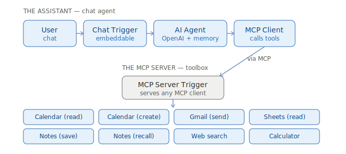
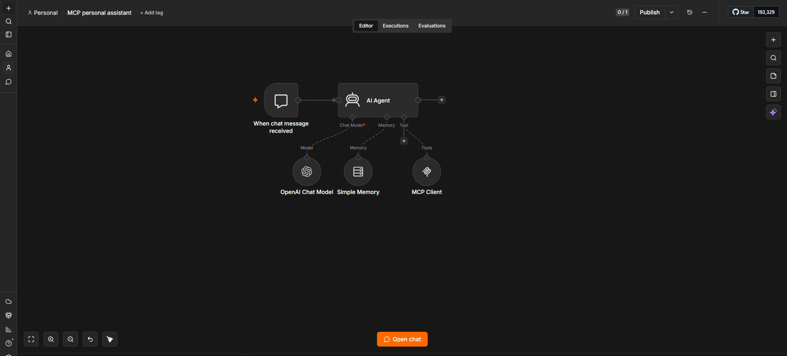
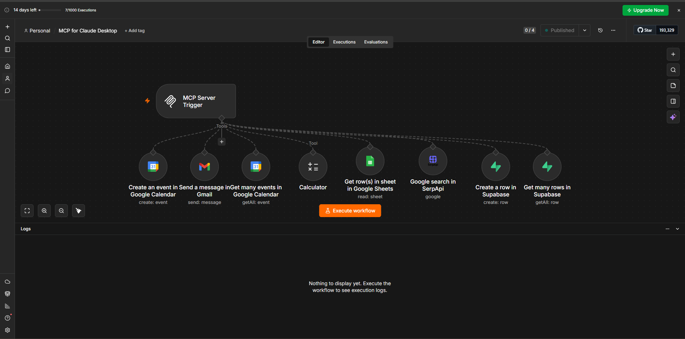

# MCP Personal Assistant (n8n + AI Agent)

A single chat agent that reaches a whole toolbox — Google Calendar, Gmail, Google
Sheets, web search, a Supabase-backed notes memory, and a calculator — through the
**Model Context Protocol (MCP)**. The agent decides which tool to call on its own by
reading each tool's name and description; there is **no hard-coded routing logic**.

Built in [n8n](https://n8n.io) as the first project in a six-build AI automation
portfolio.

---

## What it does

You chat with one assistant. Depending on what you ask, it transparently:

- checks or creates **calendar** events,
- **reads a spreadsheet**,
- **searches the web** and cites what it found,
- **saves notes** you want remembered and **recalls** them later,
- does exact **arithmetic**,
- and **drafts/sends email** — but only after asking you to confirm.

It remembers the conversation across turns, and it gates every irreversible action
(sending mail, creating events) behind an explicit "yes."

---

## Architecture

The project is **two workflows** that meet over MCP:

1. **MCP server** (`workflows/mcp-server-tools.json`) — an `MCP Server Trigger` with
   eight tool nodes hanging off it. It turns a plain n8n workflow into an MCP server
   that *any* MCP client can call (this assistant, Claude Desktop, Cursor, …).
2. **The assistant** (`workflows/mcp-personal-assistant.json`) — a Chat Trigger → AI
   Agent (LLM + conversation memory) → `MCP Client` that connects to the server above.



**Why split it in two?** Decoupling the tools (server) from the brain (agent) means the
same toolbox is reusable by other clients, and the assistant's front door can be
swapped (Chat → Telegram/WhatsApp/web widget) without touching the tools.

## Screenshots

| The assistant | The MCP server (8 tools) |
|---|---|
|  |  |

---

## The toolbox (8 tools)

| Tool | Action | Notes |
|------|--------|-------|
| Google Calendar | Get many events | reads upcoming events |
| Google Calendar | Create event | gated behind confirmation |
| Gmail | Send a message | gated behind confirmation |
| Google Sheets | Get rows | reads a sheet |
| Supabase | Create row | saves a note to the `notes` table |
| Supabase | Get many rows | recalls saved notes |
| SerpApi | Google search | live web search |
| Calculator | Evaluate | exact arithmetic |

Tool arguments the model fills in are wired with n8n's `$fromAI()` so the agent supplies
them at call time (e.g. the email subject/body, the calendar times, the note content).

---

## How tool routing works

There is no `Switch` node deciding which tool to use. The **AI Agent reads each tool's
name and description** and chooses. The descriptions are written action-first and, where
two tools look similar, disambiguated explicitly — e.g. the notes-recall tool says
*"…This is NOT spreadsheet data,"* so the agent doesn't confuse it with the Sheets
reader. That description-driven routing is the core skill this build demonstrates. See
[`prompts/system-prompt.txt`](prompts/system-prompt.txt) for the agent's operating rules.

---

## Tech stack

- **n8n** (cloud or self-hosted) — orchestration
- **OpenAI** `gpt-4o-mini` — the agent LLM (swap for any chat model; the agent is
  model-agnostic)
- **MCP** over HTTP Streamable — tool transport
- **Supabase** (Postgres) — the notes/memory store
- **Google Calendar / Gmail / Sheets** — OAuth2 integrations
- **SerpApi** — web search

---

## Setup

1. **Import both workflows** into n8n (`Workflows → ⋯ → Import from File`):
   - `workflows/mcp-server-tools.json`
   - `workflows/mcp-personal-assistant.json`
2. **Create the credentials** in your n8n instance and select them on each node:
   OpenAI, Google Calendar (OAuth2), Gmail (OAuth2), Google Sheets (OAuth2), SerpApi,
   and Supabase (project URL + `service_role` key).
3. **Create the notes table** — run [`sql/notes_table.sql`](sql/notes_table.sql) in
   Supabase's SQL Editor.
4. **Activate the MCP server** workflow, open the **MCP Server Trigger**, and copy its
   **Production URL** (looks like `https://<your-instance>/mcp/<path>`).
5. **Point the assistant at it** — paste that URL into the **MCP Client** node's
   `Endpoint`, transport `HTTP Streamable`. Run the node once to confirm all 8 tools load.
6. Open the assistant's **chat** and try it (see below).

> Placeholders in the JSON (`YOUR-N8N-INSTANCE`, `YOUR-MCP-SERVER-PATH`,
> `REPLACE_WITH_YOUR_*_CREDENTIAL`, `YOUR_GOOGLE_SHEET_ID`, `you@example.com`) are the
> spots you fill in for your own instance.

---

## Try it

```
What's on my calendar this week?
What's 1,847 × 32 + 19?
Make a note that the client demo is on Friday.
What notes do I have saved?
Search the web for the latest n8n release and tell me what's new.
Email me a one-line reminder to buy milk.    ← asks you to confirm before sending
```

---

## Security notes

- **Credentials are never committed.** n8n exports reference credentials by name only;
  no keys are in this repo. The Supabase `notes` table has Row-Level Security enabled.
- **Authenticate the MCP server before exposing it.** As shipped, the MCP Server Trigger
  can be set to no-auth for local development — but since its tools can send email and
  write calendar events, set **Authentication → Bearer Auth** on the trigger (and match
  the token in every client) before sharing the endpoint.

---

## Roadmap

This is build 1 of a six-build n8n AI automation portfolio:

1. **MCP personal assistant** ✅ (this repo)
2. Competitor intelligence tracker
3. WhatsApp lead-qualification agent
4. RAG customer-support chatbot
5. Social-media content bot
6. AI email-triage agent

---

## License

MIT — see `LICENSE` (add your preferred license file).
