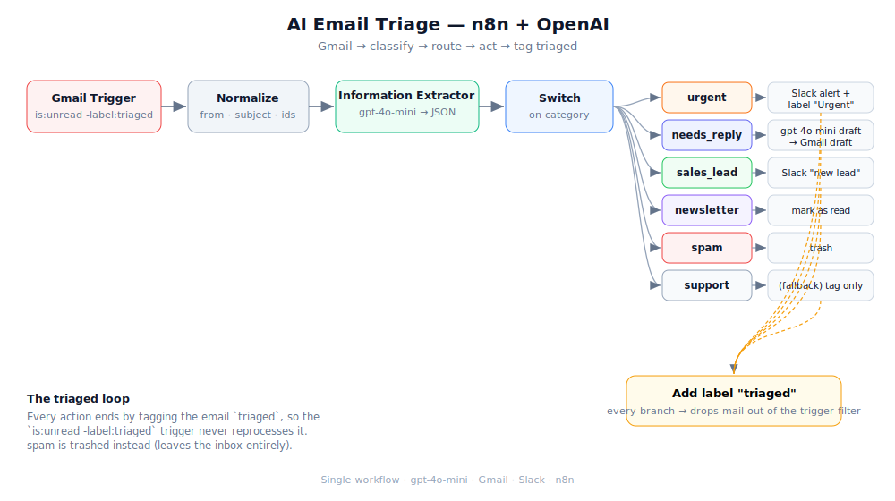
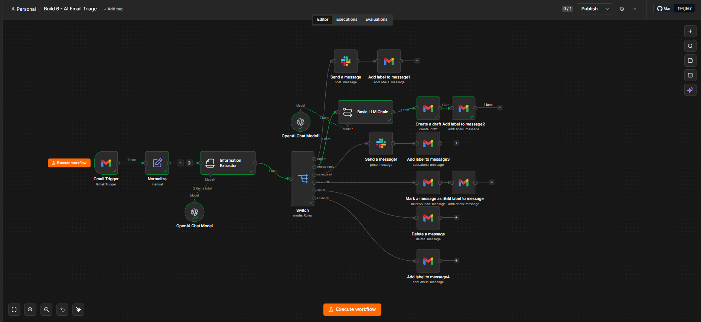
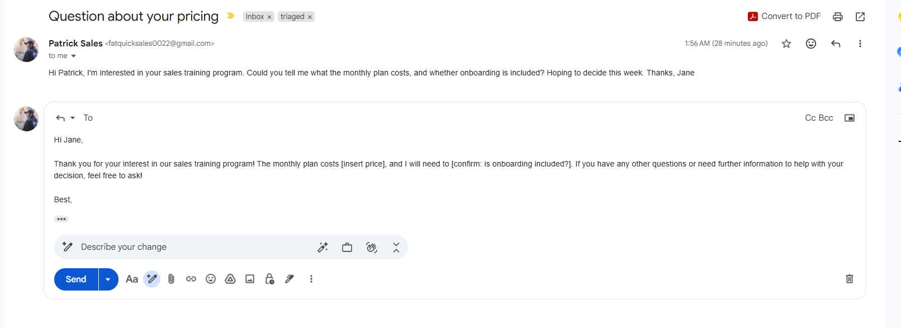
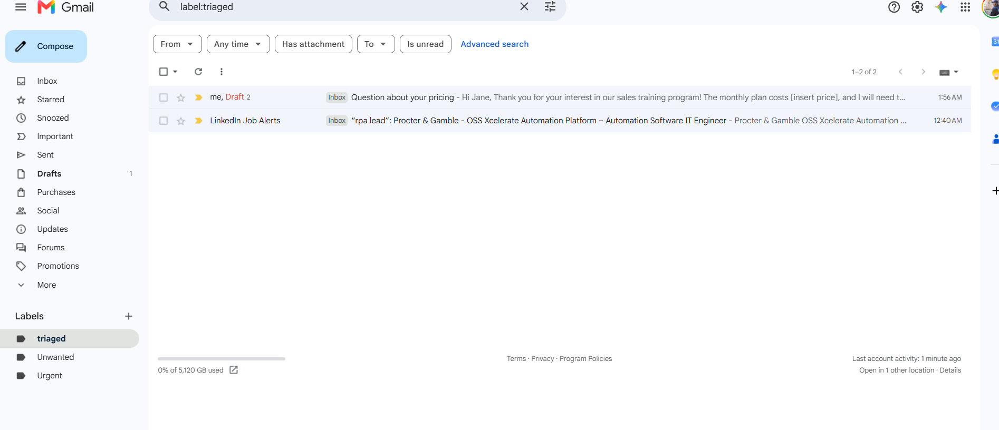

# AI Email Triage (n8n + AI)

An agent that watches an inbox, uses an LLM to **classify every incoming email**
(category + priority + whether it needs a reply), then **routes each one to the
right action** — alert on the truly urgent, **auto-draft a reply for review**, flag
sales leads, file the newsletters, and bin the spam. Every email it handles is
tagged `triaged` so it's never processed twice.

The point isn't "AI reads your email" — it's a **safe** triage layer. Nothing is
sent on your behalf: replies land in **Drafts** for a human to approve, and the
classifier is tuned to err toward the lower-risk action when an email is ambiguous.

Build 6 of a six-build AI automation portfolio.

> 📖 The two prompts that drive it live in
> [`prompts/classifier.txt`](prompts/classifier.txt) (how it sorts mail) and
> [`prompts/drafting.txt`](prompts/drafting.txt) (how it writes replies) so you can
> tune behaviour without opening the JSON.

---

## Why this exists

**The problem —** a busy inbox is mostly noise with a few things that genuinely
matter, and they're all mixed together. Manually sorting urgent-vs-newsletter-vs-
needs-a-reply burns focus every single morning. Naive "AI inbox" tools overreach —
they auto-send replies and quietly make mistakes in your name.

**The result —** an inbox that sorts *itself*. Urgent items raise a Slack alert,
real questions get a **drafted reply waiting in Drafts**, leads get flagged,
newsletters get marked read, spam gets binned — and a human still approves anything
that goes out. You skim Drafts and Slack instead of scrubbing the whole inbox.

---

## What it does

- **Watches the inbox** — Gmail Trigger polls for `is:unread -label:triaged`, so it
  only ever looks at fresh, un-triaged mail.
- **Classifies with one LLM call** — an Information Extractor (gpt-4o-mini) returns
  typed fields: `category`, `priority`, `requires_reply`, `sentiment`, `summary`,
  `suggested_action`.
- **Fans out with a Switch** — one router, six mutually-exclusive branches
  (`urgent / needs_reply / sales_lead / newsletter / spam / support`).
- **Acts per category:**
  - **urgent** → Slack alert + `Urgent` label
  - **needs_reply** → a second gpt-4o-mini call drafts a reply → saved to Gmail
    **Drafts** in the original thread (never sent)
  - **sales_lead** → Slack "new lead" alert
  - **newsletter** → marked as read
  - **spam** → trashed
  - **support** (fallback) → left in the inbox, just tagged
- **Closes the loop** — every branch ends by adding a `triaged` label, which drops
  the email out of the trigger filter so it's never reprocessed.

---

## Architecture

Single workflow. Real Gmail in, real Gmail/Slack actions out, two gpt-4o-mini calls
(one to classify, one to draft).

---

## Demo

A live run — an inbound email is classified, the **Switch** routes it to the matching
branch, and that branch acts (draft a reply / label / alert) before tagging it `triaged`.

---

## Screenshots

**The workflow** — Gmail Trigger → Normalize → classify → Switch fan-out → six branches, each ending in a `triaged` label:

**The drafted reply** — a real "pricing question" was classified `needs_reply` and a reply was written to **Drafts** for review. Note it refuses to invent facts: **`[insert price]`** and **`[confirm: is onboarding included?]`** are placeholders for a human to fill, never made-up commitments:

**The triaged loop** — every handled email is tagged `triaged`, so the `is:unread -label:triaged` trigger never reprocesses it (here: the drafted pricing email + a newsletter that was marked read):

---

## How it works (node by node)

| Stage | Node | What it does |
|-------|------|--------------|
| Trigger | **Gmail Trigger** | Polls for `is:unread -label:triaged` (Simplify on). |
| Normalize | **Normalize** (Set) | Flattens to `from`, `subject`, `threadId`, `messageId`, `bodyTrimmed` (body capped at 4000 chars). |
| Classify | **Information Extractor** (+ gpt-4o-mini) | Fills the typed triage schema from the email text. |
| Route | **Switch** (Rules) | Branches on `{{ $json.output.category }}`, fallback = `support`. |
| urgent | **Slack** → **Add label** | Alert to a channel + `Urgent` + `triaged` labels. |
| needs_reply | **Basic LLM Chain** (+ gpt-4o-mini) → **Create draft** | Drafts a reply, saves it to the thread (no send). |
| sales_lead | **Slack** → **Add label** | "New lead" alert + `triaged`. |
| newsletter | **Mark as read** → **Add label** | Quiets it + `triaged`. |
| spam | **Delete a message** | Moves it to trash. |
| support | **Add label** | `triaged` only; stays in the inbox. |

### Two details worth knowing

- **Cross-node references use `.first()`, not `.item`.** The branch actions need the
  email's `messageId` / `threadId`, which come from **Normalize** — *before* the
  Information Extractor (an AI node). Reaching back across an AI node with
  `$('Normalize').item` mangles paired-item references; `$('Normalize').first()` is
  reliable because exactly one email flows per run.
- **The classifier output nests under `output`.** Downstream expressions read
  `{{ $json.output.category }}`, not `{{ $json.category }}`.

---

## Setup

1. **Import** `workflows/ai-email-triage.json` into n8n.
2. **Reconnect credentials** (all replaced with placeholders): OpenAI, Gmail OAuth2,
   Slack.
3. **Create two Gmail labels** — `triaged` and `Urgent` — then re-select them in the
   five "Add label" nodes (the exported label IDs are placeholders).
4. **Set the Slack channel** in the two Slack nodes (`YOUR_SLACK_CHANNEL_ID`).
5. **Test before activating** — fetch a real email with the trigger's *Fetch Test
   Event*, run the workflow, and check **Drafts** for the drafted reply. Only
   activate once it behaves.

> ⚠️ The Gmail Trigger polls every minute. On a trial instance with an execution
> cap, **leave the workflow inactive** and test with manual fetches; widen the poll
> interval before running it live.

---

## Security notes

- **No secrets in this repo.** n8n exports *reference* credentials by name only — no
  API keys. Credential IDs, the instance ID, the Slack channel + webhook IDs, and
  the Gmail label IDs are replaced with placeholders / regenerated.
- **Nothing is sent automatically.** Replies are written to **Drafts**; a human
  approves and sends. The only outbound actions are Slack alerts to your own channel.
- **The classifier is risk-averse by design** — ambiguous mail defaults to the
  lower-risk category and medium priority.

---

## Results & highlights

- **One Switch, six actions** — a single classification fans out to six distinct,
  mutually-exclusive handlers; the new primitive over a simple true/false IF.
- **Human-in-the-loop replies** — the standout: a drafted, on-tone reply waiting in
  Drafts, with **`[bracketed placeholders]` instead of invented prices or promises**.
- **Doesn't reprocess** — the `triaged` label + trigger filter form a clean,
  idempotent loop; re-runs don't double-handle mail.
- **Tuned, not just wired** — a drafting-prompt constraint was added after testing
  because gpt-4o-mini would answer yes/no questions it had no basis for; the fix
  forces placeholders. (See [`prompts/drafting.txt`](prompts/drafting.txt).)
- **Portable** — point it at any inbox; adjust the categories and branch actions to
  fit a support desk, a sales inbox, or a personal one.

---

## Roadmap

Build 6 of a six-build n8n AI automation portfolio:

1. MCP personal assistant ✅
2. Competitor intelligence tracker ✅
3. WhatsApp lead-qualification agent ✅
4. RAG customer-support chatbot ✅
5. Social-media content bot ✅
6. **AI email-triage agent** ✅ (this repo)

---

## License

MIT — see `LICENSE` (add your preferred license file).
