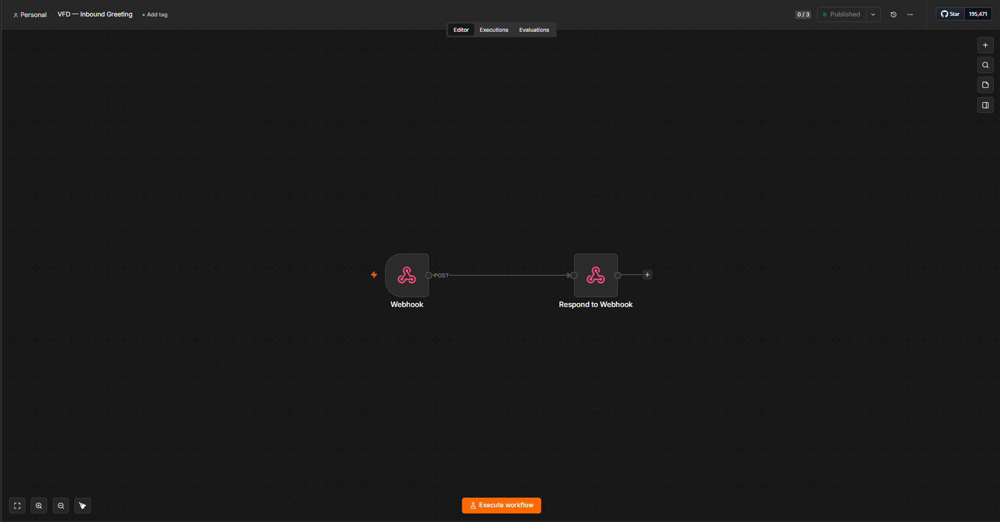
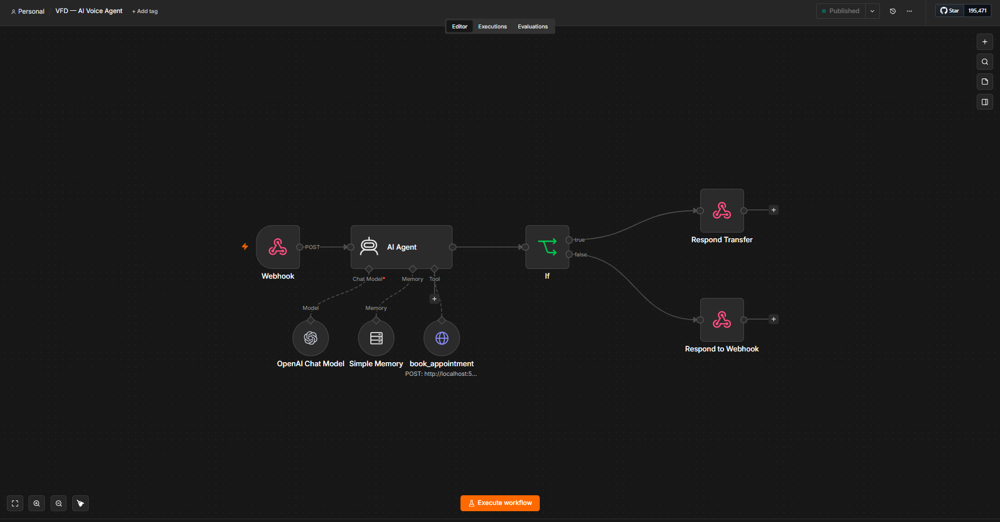
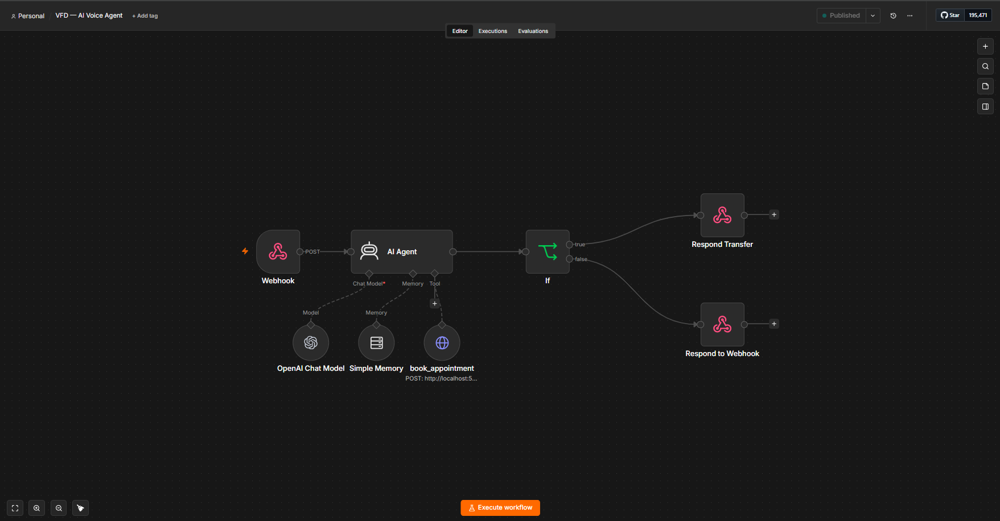
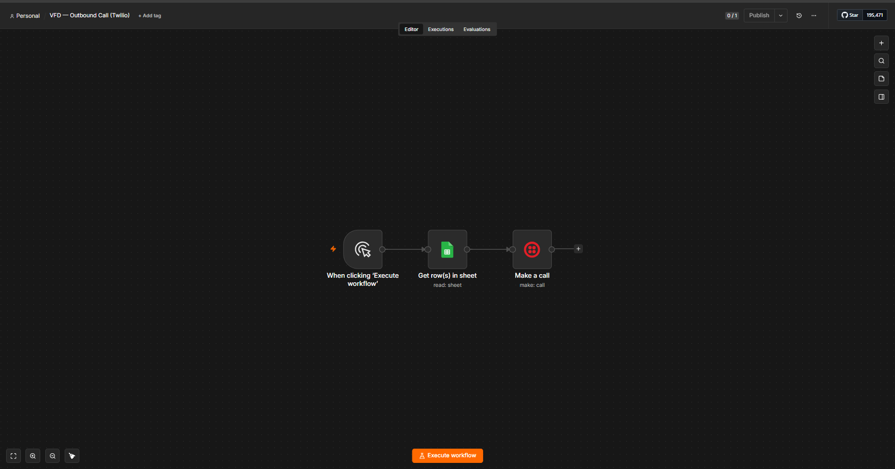

# AI Voice Front Desk (Twilio + n8n + OpenAI)

An AI voice agent that answers the phone, **qualifies callers, books appointments, and
transfers to a human** — and can also run **outbound**, dialing a lead list and pitching
each one. One shared "brain" powers both directions, and every booking lands on a real
Google Calendar with a Google Sheet as the system of record.

Built to mirror what a real AI receptionist / AI SDR needs in production: turn-based
speech over the phone, mid-call calendar booking, fair round-robin across staff, an
availability guard so nobody gets double-booked, and a clean hand-off to a human when the
caller asks for one.

---

> 📖 **[WALKTHROUGH.md](WALKTHROUGH.md)** explains every node, step by step.


## What it does

**📞 Inbound receptionist**
1. Greets the caller and asks how it can help.
2. Understands free-form speech (booking requests, questions, "talk to a person").
3. **Reads the details back and waits for a "yes"** before it books anything.
4. Books the appointment, **round-robins across three stylists**, and only offers a slot
   that is **actually free** (checks each calendar's availability first).
5. Confirms the booking out loud (with the assigned stylist), logs it to a sheet, and
   fires an SMS confirmation.

**📤 Outbound SDR**
- Reads a lead list from a Google Sheet, dials each lead, and opens with a **personalized
  pitch**. The lead's reply funnels into the exact same brain — so it can qualify and book
  on the outbound call too.

**🙋 Human transfer**
- If the caller asks for a real person (or is clearly frustrated), the agent stops the AI
  loop and **`<Dial>`s a human**.

---

## How it's built

```
Twilio number ──▶ Inbound Greeting ──▶ AI Voice Agent ──┬─▶ Smart Booking (webhook)
   (voice)          (TwiML <Say>+       (gpt-4o-mini +   │      round-robin + availability
                     <Gather speech>)    memory + tools)  │      → Google Calendar + Sheet + SMS
                                                          └─▶ Human transfer (<Dial>)
```

- **Turn-based voice** — each turn is a Twilio `<Gather input="speech">` → n8n webhook →
  OpenAI → TwiML response. No streaming server required; it's pure n8n.
- **Per-call memory** — keyed by Twilio `CallSid`, so the agent remembers the conversation
  within a call.
- **Deterministic booking** — the LLM decides *what* to book; a dedicated booking workflow
  decides *who* and *whether the slot is free*, so scheduling logic never depends on the
  model guessing.
- **Booking runs as its own top-level webhook** and the agent calls it over HTTP. This
  keeps the calendar/round-robin logic decoupled and reusable across inbound *and*
  outbound, and sidesteps a self-hosted task-runner limitation with code steps inside
  agent-invoked sub-workflows.

**Stack:** Twilio (voice + SMS) · n8n · OpenAI `gpt-4o-mini` · Google Calendar · Google
Sheets.

---

## Workflows

| File | Role |
|------|------|
| [`inbound-greeting.json`](workflows/inbound-greeting.json) | The first thing a caller hears; returns the greeting TwiML and hands the conversation to the agent. |
| [`ai-voice-agent.json`](workflows/ai-voice-agent.json) | The brain — OpenAI chat + per-call memory, the `book_appointment` tool, and the human-transfer branch. |
| [`smart-booking.json`](workflows/smart-booking.json) | Round-robin across 3 stylists, per-calendar availability check, creates the event, logs the row, sends the SMS. |
| [`outbound-sdr-dialer.json`](workflows/outbound-sdr-dialer.json) | Reads a lead list and places a personalized outbound call to each lead. |

---

## Workflow canvases

**Inbound Greeting** — answers the call and hands off to the agent.


**AI Voice Agent** — the brain: OpenAI chat + per-call memory + the `book_appointment` tool, with an `If` branch that routes "talk to a human" to a `<Dial>` transfer.


**Smart Booking** — round-robin across three stylists, per-calendar availability check, create event → log row → SMS → respond.


**Outbound SDR Dialer** — reads a lead sheet and places a personalized outbound call to each lead.


---

## ⚡ Vapi realtime upgrade (inbound)

The Twilio flow above is **turn-based** — every turn is a `<Gather>` → webhook → response
round-trip, with the pauses you'd expect from request/response. To get the **natural,
low-latency conversation** clients expect from a modern AI receptionist, the same front desk
was put behind **[Vapi](https://vapi.ai)**, a realtime (streaming speech-to-speech) voice
platform.

The point worth noticing: **the booking engine didn't change.** Because Smart Booking already
runs as its own top-level `/webhook/vfd-book`, the Vapi assistant reuses it *verbatim* — the
decoupled design from the Twilio build paid off directly.

```
Phone ─▶ Vapi assistant ─▶ book_appointment (tool) ─▶ Vapi Booking Adapter ─▶ Smart Booking
(realtime)  Deepgram +        transfer_call (tool)        (n8n webhook)        (same brain:
            gpt-4o-mini +          │                                            round-robin +
            streamed voice         │                                            availability)
                                   └▶ end-of-call report ─▶ Inbound Call Logger ─▶ Google Sheet
```

- **~840 ms end-to-end latency** (Deepgram transcription + `gpt-4o-mini` + streamed voice) —
  it feels like talking to a person, not navigating a phone tree.
- **Same deterministic booking** — a thin **adapter** translates Vapi's tool-call format into
  the existing booking webhook and wraps the confirmation back into Vapi's tool-result shape,
  so the assistant speaks the real result (with the assigned stylist).
- **Native transfer** — a Vapi **Transfer Call** tool replaces the Twilio `<<TRANSFER>>` string
  convention.
- **Every call logged** — Vapi posts an end-of-call report; a logger re-fetches the full call
  (free) for transcript + recording and appends one row per call to a sheet.

### New workflows

| File | Role |
|------|------|
| [`vapi-booking-adapter.json`](workflows/vapi-booking-adapter.json) | Bridges the Vapi assistant's `book_appointment` tool to the existing Smart Booking brain — extracts the tool args + caller number, calls the booking webhook, and returns the confirmation in Vapi's tool-result format. |
| [`vapi-inbound-logger.json`](workflows/vapi-inbound-logger.json) | Catches Vapi's end-of-call report, re-fetches the full call from the Vapi API, and appends `ended_at / caller_number / cost / summary / recording_url / transcript / …` to a Google Sheet. |

> The Vapi assistant itself (model, voice, system prompt, and the two tools) is configured in
> the Vapi dashboard — these two workflows are the n8n side of the integration.

---

## Notes

- Phone numbers, host URLs, calendar IDs, and credentials in the JSON are placeholders or
  references — swap in your own Twilio number, n8n host (or a tunnel for local dev), Google
  Calendar/Sheet IDs, and credentials to run it.
- For a stable public URL (so Twilio can reach a locally-hosted n8n), use a tunnel
  (cloudflared / ngrok) or a hosted n8n instance, and point the Twilio number's Voice
  webhook at `https://YOUR_N8N_HOST/webhook/voice-inbound`.
