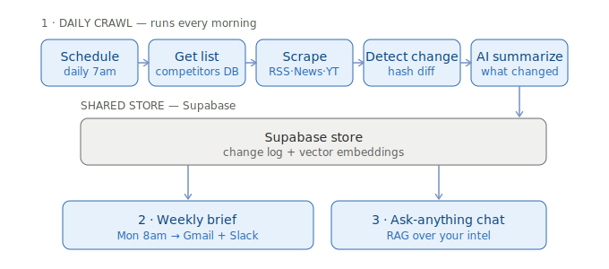
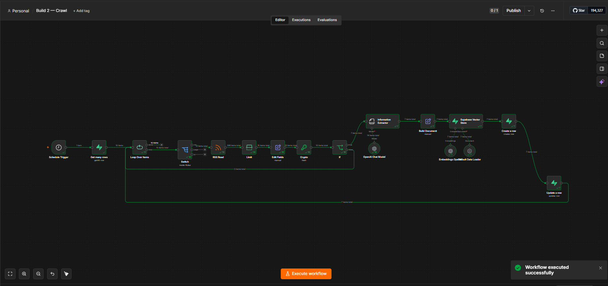
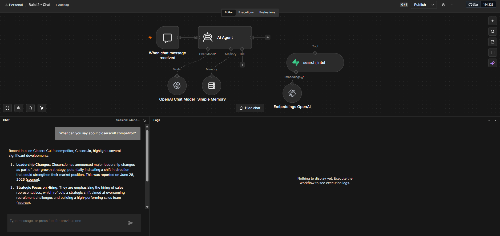
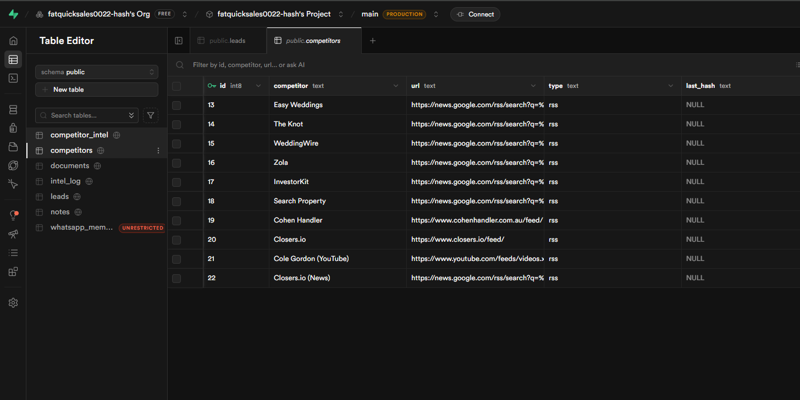
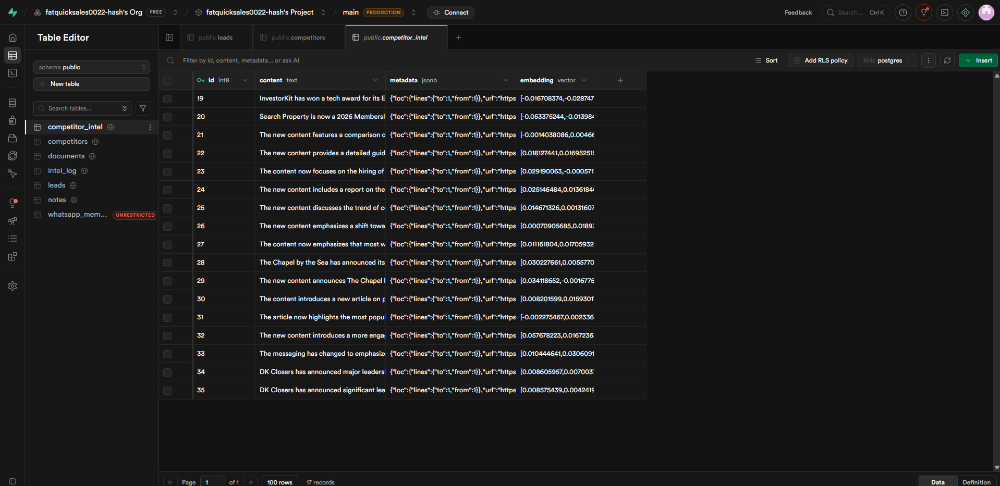
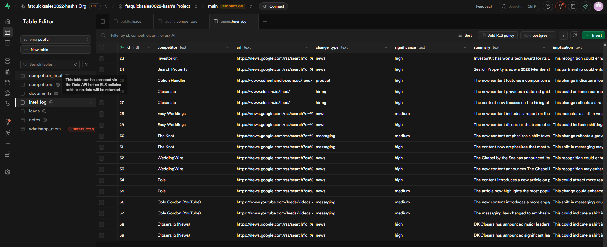

# Competitor Intelligence System (n8n + AI + RAG)

An automated competitor-tracking system. Every morning it checks each
competitor's news and content, uses AI to detect and summarize **only what
changed**, stores it, and posts a weekly brief to email and Slack. You can also
**chat with it** to ask questions about any competitor.

It's designed **multi-tenant** — one pipeline tracks competitors for three
separate businesses, each tagged by `brand`, so every output is organized per
business. (Companies like Crayon, Klue, and Kompyte sell this as software; this
is a working version built in [n8n](https://n8n.io).)

Build 2 of a six-build AI automation portfolio.

---

## Why this exists

**The problem —** keeping tabs on competitors means manually checking a dozen blogs,
news feeds, and channels — it's tedious, easy to forget, and you still miss things.
Purpose-built tools (Crayon, Klue, Kompyte) solve it but cost hundreds a month.

**The result —** an always-on tracker that watches the whole list daily, uses AI to
surface **only what actually changed**, and drops a sectioned weekly brief into email
and Slack. A content-hash diff means the AI only runs on real changes, so daily
monitoring costs cents — and one pipeline covers `[N]` competitors across 3 businesses.

---

## What it does

- **Crawls** a watch-list of competitors daily (RSS, Google News, YouTube feeds).
- **Detects real changes** with a content hash, so unchanged pages are skipped —
  the AI only runs on what actually changed (cheap to run daily).
- **Summarizes** each change with AI into structured fields: category, significance,
  a one-line summary, and what it means for you.
- **Stores** every change two ways: as rows (for reporting) and as vector
  embeddings (for semantic search).
- **Emails + Slacks** a weekly brief, organized into one section per business.
- **Answers questions** over everything collected via a RAG chat agent.

---

## Architecture



> 📖 **Want the details?** [`WALKTHROUGH.md`](WALKTHROUGH.md) explains every node in all
> three workflows — and the key expressions — line by line.

Three workflows over one shared Supabase store — *write the intel once, read it
two ways*:

| Workflow | File | Runs | Does |
|---|---|---|---|
| **Crawl** | [`workflows/crawl.json`](workflows/crawl.json) | daily 7am | scrape → hash-diff → AI summarize → store |
| **Digest** | [`workflows/digest.json`](workflows/digest.json) | Mondays 8am | aggregate the week → AI brief → Gmail + Slack |
| **Chat** | [`workflows/chat.json`](workflows/chat.json) | on demand | RAG agent answers over the stored intel |

### The Crawl pipeline (node by node)

```
Schedule → Get competitors (Supabase) → Loop Over Items
   → Switch (by feed type: rss / page / js)
   → RSS Read → Limit (latest item)
   → Edit Fields (normalize: competitor, brand, url, text)
   → Crypto (SHA-256 hash)
   → IF (hash ≠ last_hash?)
        ├─ false → Update Row (save hash) ──┐  (skips the LLM — nothing changed)
        └─ true  → Information Extractor (AI)│
                   → Build Document          │
                   → Vector Store (insert)   │
                   → Create Row (intel_log)  │
                   → Update Row (save hash) ──┤
                                  (loops back to next competitor)
```

The **hash comparison is the key idea**: a fingerprint of today's content is
compared to yesterday's. If it matches, the expensive AI step is skipped
entirely — so crawling all competitors every day costs cents, not dollars.

---

## Demo


A live chat run — a question about a competitor is answered from the intel vector
store via the `search_intel` tool, citing the competitor, source, and date.

---

## Screenshots

**Crawl pipeline** — a full run: scrape → hash-diff → AI summarize → vector store + log (item counts on every node):



**The chat** — a RAG agent answering a real competitive question, grounded in the stored intel:



**Real competitors tracked** — the `competitors` seed across three businesses (weddings, property, sales training):



**Vector store** — `competitor_intel`: each detected change embedded for retrieval (content + metadata + 1536-d vector):



**Relational log** — `intel_log`: every change with type, significance, summary, and business implication (the digest's source):



---

## Tech stack

- **n8n** (cloud or self-hosted) — orchestration
- **OpenAI** — `gpt-4o-mini` (summaries, digest, chat) + `text-embedding-3-small`
  (1536-dim embeddings). The AI nodes are model-agnostic; swap as you like.
- **Supabase** (Postgres + **pgvector**) — the shared store (change log + vectors)
  and the change-detection memory
- **Gmail / Slack** — weekly brief delivery
- **RAG** (Retrieval-Augmented Generation) — the chat layer is grounded only in
  stored intel

---

## Setup

1. **Create the database** — run [`sql/schema.sql`](sql/schema.sql) in Supabase's
   SQL Editor. It creates the `competitors`, `competitor_intel`, and `intel_log`
   tables, the `match_competitor_intel` search function, and an example watch-list.
   New to SQL? [`sql/schema-explained.sql`](sql/schema-explained.sql) is the exact
   same schema annotated **line by line**.
2. **Import the three workflows** into n8n (`Workflows → ⋯ → Import from File`):
   `workflows/crawl.json`, `workflows/digest.json`, `workflows/chat.json`.
3. **Create credentials** in your n8n instance and select them on each node:
   OpenAI, Supabase (project URL + `service_role` key), Gmail (OAuth2), Slack
   (OAuth2). The JSON ships with `REPLACE_WITH_YOUR_*_CREDENTIAL` placeholders.
4. **Fill in the placeholders:** the Gmail recipient (`you@example.com`) and the
   Slack channel (`YOUR_SLACK_CHANNEL_ID`).
5. **Add your competitors** — edit the `competitors` table. `type='rss'` works out
   of the box. For a competitor with no feed, **Google News RSS** works for any
   company:
   `https://news.google.com/rss/search?q=%22Company+Name%22&hl=en-US&gl=US&ceid=US:en`
6. **Activate** the Crawl and Digest workflows so their schedules fire. The Chat
   workflow runs on demand via its chat panel / embeddable widget.

The prompts live in [`prompts/`](prompts/) (per-change extractor, weekly digest,
chat system message) so you can read/tune them without opening the JSON.

---

## Try the chat

```
What's the latest on <competitor>?
Any moves from my property competitors?
Which competitor changed pricing this month?
Summarize what changed across all brands this week.
```

---

## Security notes

- **No secrets in this repo.** n8n exports *reference* credentials by name only —
  no API keys. Credential IDs, instance IDs, and the email/Slack channel are
  replaced with placeholders.
- **Tables are backend-only.** RLS is enabled on every table; n8n connects with
  the `service_role` key (which bypasses RLS), so nothing is exposed to the public
  `anon` key.
- **Competitor lists live in the database, not the workflows** — so the exported
  JSON reveals no business data. The example schema seeds generic competitors
  (TechCrunch / The Verge) and generic brand names (Brand A/B/C).

---

## Results & highlights

- **Replaces a $100s/month SaaS category** (Crayon/Klue/Kompyte) with a workflow you own.
- **Cheap to run daily** — the hash-diff skips the LLM on unchanged pages, so the AI
  cost scales with *real changes*, not with how often you check.
- **Multi-tenant** — one pipeline serves 3 separate businesses, each tagged by `brand`,
  with the weekly brief auto-sectioned per business.
- **Two ways to consume it** — a scheduled written brief *and* a RAG chat you can
  interrogate ("which competitor changed pricing this month?").

---

## Roadmap

Build 2 of a six-build n8n AI automation portfolio:

1. MCP personal assistant ✅
2. **Competitor intelligence tracker** ✅ (this repo)
3. WhatsApp lead-qualification agent
4. RAG customer-support chatbot
5. Social-media content bot
6. AI email-triage agent

---

## License

MIT — see `LICENSE` (add your preferred license file).
