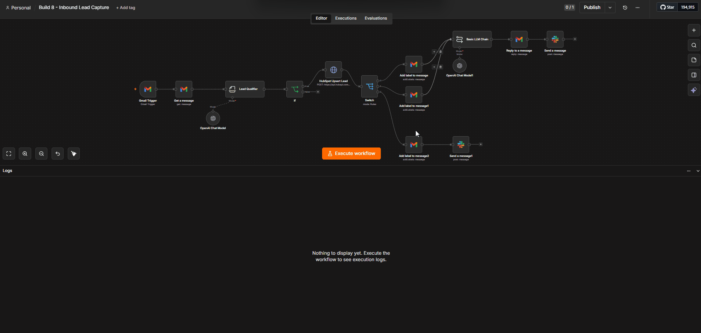

# CRM Lead Engine (n8n + AI + HubSpot)

Two AI workflows that share one engine and one system of record — a **HubSpot CRM**.
Together they keep the CRM clean **and** make sure no new lead is ever missed:

1. **CRM Enrichment & Scoring Agent** — on a schedule, sweeps the contacts already in
   HubSpot, uses an LLM to **clean, infer, segment, and score** each record, and writes
   the results straight back into custom properties. Idempotent: it never re-processes a
   contact it has already enriched.
2. **Inbound Lead Capture** — watches an inbox, uses an LLM to decide whether each email
   is a genuine lead, extracts the lead's details, **creates the contact in HubSpot**,
   routes it by temperature (hot / warm / cold), auto-replies to the warm-and-hot ones,
   and alerts Slack.

The point isn't "AI touches your data" — it's that **every improvement lands in the CRM
your team already lives in**, so it's permanent and actionable, not a throwaway report.

> 🧠 The three prompts that drive the behaviour live in
> [`prompts/enrichment-classifier.txt`](prompts/enrichment-classifier.txt) (how it cleans
> + scores existing contacts),
> [`prompts/lead-qualifier.txt`](prompts/lead-qualifier.txt) (how it decides lead vs.
> not-lead and scores temperature), and
> [`prompts/reply-drafter.txt`](prompts/reply-drafter.txt) (how it replies) — tune
> behaviour without opening the JSON.

---

## Why this exists

**The problem —** CRMs rot. Contacts arrive half-filled (`john` / blank company /
lowercase names), and new leads land as ordinary emails mixed in with newsletters and
noise. Someone has to clean the records, judge which emails are real opportunities, log
them, and reply fast — or the data goes stale and good leads go cold.

**The result —** the CRM maintains *itself*. Existing contacts get proper-cased,
company-inferred, seniority-tagged, and quality-scored. New inbound leads are qualified,
scored by temperature, written into HubSpot as leads, and answered instantly — with a
Slack ping to the team. You work a clean, ranked CRM instead of triaging raw mail and
patching records by hand.

---

## Honest framing (what this is — and isn't)

- The enrichment is **inference + cleanup from data already on the record** — email
  domain → company, job title → seniority, casing fixes, segmentation, a data-quality
  score. It is **not** external data-append (Clearbit / Apollo); nothing is bought or
  scraped. Every field is reasoned from what's already there.
- The inbound qualifier judges **genuine buying intent**, and deliberately treats a
  *missing* name/company/phone as a data-quality issue — **not** a reason to drop a real
  lead. An incomplete "do you do bulk pricing?" is still captured.

---

## What it does

### Lane 1 — CRM Enrichment & Scoring Agent
- **Pulls a batch** of HubSpot contacts (`Get Many` / `Search`), skipping any already
  marked `ai_enriched` — a **Filter** node makes re-runs idempotent, so no AI spend is
  wasted re-processing done records.
- **Loops one contact at a time** (batch size 1) so each AI reference resolves cleanly.
- **One LLM call per contact** (Information Extractor, gpt-4o-mini) returns a typed
  schema: normalised name, `company_name`, `company_domain`, `industry`, `seniority`,
  `segment`, `summary`, `data_quality_score`.
- **Writes back to HubSpot** via a REST call into custom properties (`ai_summary`,
  `ai_seniority`, `ai_company_domain`, `data_quality_score`, `ai_enriched`, …).
- **Reports to Slack** — "enriched N contacts, avg score X, seniority mix …".
- **Scheduled** for daily runs (left inactive in the export; run on demand to demo).

### Lane 2 — Inbound Lead Capture
- **Watches the inbox** (Gmail Trigger) and pulls the **full** decoded body via a Gmail
  *Get a message* (the trigger alone only exposes a truncated snippet).
- **Qualifies with one LLM call** (Information Extractor as an *inclusive gate*):
  `is_lead`, `confidence`, `reason`, `lead_temperature`, plus extracted `contact_name`,
  `company_name`, `contact_email` (read from the body, not the envelope), `phone`,
  `intent`, `summary`, `data_quality_score`.
- **Routes on a boolean IF** — only genuine leads *with an email* continue (guards
  against junk, email-less records).
- **Creates / updates the lead in HubSpot** by email upsert (`lifecyclestage = lead`,
  `lead_temperature`, and the AI fields) — deduped, no double contacts.
- **Routes by temperature (Switch)** into the team's Gmail labels:
  - 🔥 **hot** → `Urgent` label + **auto-reply** + Slack
  - 🌤️ **warm** → `Leads` label + **auto-reply** + Slack
  - ❄️ **cold** → `triaged` label + **no** reply (saved, nurtured later) + Slack
- **Auto-replies** to hot/warm with a Basic LLM Chain on a deliberately **safe prompt** —
  it acknowledges by name and promises follow-up, and is forbidden from quoting prices,
  making commitments, or inventing details.
- **Won't loop on itself** — the qualifier is instructed to classify the workflow's own
  outbound acknowledgments as *not a lead*, so auto-replies never get re-ingested as new
  leads.

---

## Architecture

```
LANE 1 — ENRICHMENT (scheduled)
Schedule / Manual → HubSpot Get Many → Filter (skip ai_enriched)
  → Loop (batch 1) → Normalize → Information Extractor (gpt-4o-mini)
      → HubSpot write-back (REST) → back to loop
  → (done) → aggregate → Slack report

LANE 2 — INBOUND (event-driven)
Gmail Trigger → Get a message (full body) → Lead Qualifier (gate + extract)
  → IF (is_lead && has email)
      → HubSpot upsert (lifecyclestage=lead)
      → Switch(temperature)
          ├ hot  → label Urgent   ┐
          ├ warm → label Leads    ┼→ Reply Drafter → Gmail Reply → Slack
          └ cold → label triaged  ┘→ Slack (no reply)
```

---

## Demo

**Inbound Lead Capture** — a raw email arrives, the AI qualifies it, creates the lead in
HubSpot, routes it by temperature, auto-replies, and pings Slack:



> A demo of the scheduled **CRM Enrichment & Scoring** lane is on the way.

---

## Setup

1. Import both files in [`workflows/`](workflows/) into your n8n instance.
2. Create the credentials the nodes ask for (each shows a
   `REPLACE_WITH_YOUR_…_CREDENTIAL` placeholder): **HubSpot** (OAuth2 **and** a
   Header-Auth entry holding a Private-App token for the REST write-back), **OpenAI**,
   **Slack**, and **Gmail** (inbound lane).
3. In HubSpot, create the custom contact properties the workflows write to:
   `ai_summary`, `ai_segment`, `ai_industry`, `ai_seniority`, `ai_company_domain`,
   `data_quality_score` (number), `ai_enriched` (checkbox), and `lead_temperature`.
4. Point the Slack nodes at your channel (replace `YOUR_SLACK_CHANNEL_ID`).
5. Run the enrichment lane manually first; activate the Schedule Trigger when happy.

---

## Stack

- **Orchestration:** n8n
- **LLM:** OpenAI gpt-4o-mini / gpt-4o (Information Extractor + Basic LLM Chain)
- **CRM:** HubSpot (native OAuth2 node + REST write-back via Header Auth)
- **Interfaces:** Gmail (inbound + auto-reply) · Slack (alerts)

---

Part of the [n8n Automation Portfolio](../README.md).
