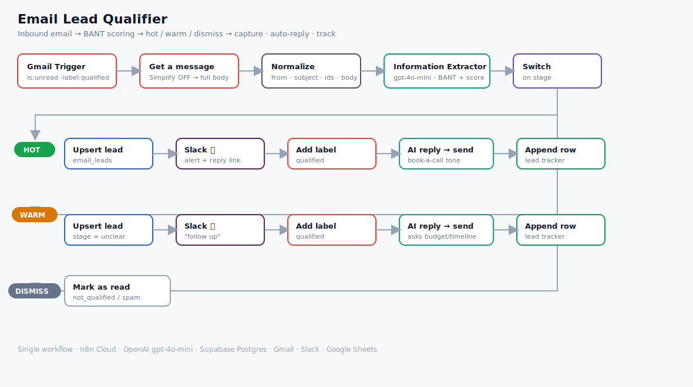

# Email Lead Qualifier (n8n + AI)

An agent that watches an inbox, uses an LLM to **qualify every inbound email against
BANT** (Budget, Authority, Need, Timeline), scores it 0–100, and then **routes it by
temperature** — hot leads get captured and pushed toward a call, warm leads get
captured *and nurtured* for the details they're missing, and non-leads are quietly
dismissed. Every real lead lands in a database, a shared tracker sheet, and a Slack
alert — and gets an instant, on-tone acknowledgment reply.

The point isn't "AI reads your email" — it's that **no genuine lead slips through and
none goes cold**. The build's defining choice is the **warm** path: an early-stage
inquiry with no budget or timeline yet isn't spam, so it's captured and answered with
a reply that *asks* for the missing details, instead of being ignored.

Build 7 — the first expansion build beyond the original six-build portfolio. It reuses
the Gmail intake from the email-triage build and the BANT scoring from the WhatsApp
lead-qualifier, combined into a purpose-built email qualifier.

> 📖 The three prompts that drive it live in
> [`prompts/classifier.txt`](prompts/classifier.txt) (how it scores),
> [`prompts/hot-reply.txt`](prompts/hot-reply.txt) and
> [`prompts/warm-reply.txt`](prompts/warm-reply.txt) (how it replies) — tune behaviour
> without opening the JSON.

---

## Why this exists

**The problem —** inbound leads arrive as ordinary emails, mixed in with everything
else. Someone has to read each one, judge whether it's a real opportunity, figure out
how ready they are to buy, log it somewhere, and reply fast — before the prospect
cools off or checks a competitor. Do it by hand and leads sit unread; the good
early-stage ones ("just checking what you offer") are the easiest to lose.

**The result —** an inbox that qualifies *itself*. Each email is scored against BANT,
sorted into **hot / warm / dismiss**, captured to a database + a human-friendly
tracker, and answered instantly. The team gets a Slack ping with a one-click link
straight to the thread. You work a ranked list instead of triaging raw mail.

---

## What it does

- **Watches the inbox** — Gmail Trigger polls `is:unread -label:qualified`, so it only
  ever looks at fresh, un-handled mail.
- **Reads the *whole* email** — a Gmail **Get a message** (Simplify OFF) pulls the full
  decoded body; the trigger alone only exposes a truncated snippet.
- **Scores with one LLM call** — an Information Extractor (gpt-4o-mini) returns a typed
  BANT schema: `is_lead`, `name`, `company`, `budget`, `authority`, `need`, `timeline`,
  `score` (0–100), `stage`, `summary`.
- **Routes with a Switch** — three mutually-exclusive branches on `stage`:
  - **Hot** (`qualified`) → capture + 🔥 Slack + `qualified` label + **AI reply that
    pushes to book a call** + tracker row
  - **Warm** (`unclear`) → capture (as `unclear`) + 🌤️ Slack + `qualified` label + **AI
    reply that asks for budget & timeline** + tracker row
  - **Dismiss** (fallback: `not_qualified` / spam / newsletter) → mark as read, nothing
    else
- **Captures state** — an idempotent `INSERT … ON CONFLICT (email)` upsert into
  Supabase `email_leads` (deduped current state, keyed on the sender's email).
- **Tracks for humans** — appends every lead to a Google Sheet board (with a `Status`
  column you own and a one-click "Open Email" link).
- **Acknowledges instantly** — a gpt-4o-mini reply is **sent in-thread**, tuned to the
  lead's temperature, with a hard rule against placeholders or invented specifics.

---

## Architecture

Single workflow. Real Gmail in; real Gmail / Slack / Postgres / Sheets actions out;
three gpt-4o-mini calls (one to score, one per lead branch to reply).

### Data design — two layers, on purpose

Leads are written to **two** places, and that's deliberate — each does a job the other
can't. **Supabase `email_leads` is the system of record:** an `INSERT … ON CONFLICT
(email)` upsert keyed on the sender's email, so re-contacts update the existing row
instead of duplicating it — the kind of keyed, deduped state a spreadsheet can't hold
without a racey lookup-then-write. The **Google Sheet is the human front-of-house:** a
readable, shareable tracker with a `Status` column a rep owns by hand and a one-click
link to the thread. Postgres is the source of truth the automation trusts; the Sheet is
the disposable view a person actually works from. (Airtable would swap the Sheet for a
prettier board — worth it only if a non-technical user *manages* leads there daily; for
a glance-and-update tracker, Sheets is free and instant.)

---

## Demo

The full workflow — Gmail intake → full-body fetch → BANT scoring → the hot/warm/dismiss
Switch → per-branch capture, alert, label, auto-reply, and tracker row.

---

## How it works (node by node)

| Stage | Node | What it does |
|-------|------|--------------|
| Trigger | **Gmail Trigger** | Polls `is:unread -label:qualified` (Simplify on, max 1). |
| Full body | **Get a message** | Simplify **OFF** → decoded `text` / `html` (the trigger only gives a snippet). |
| Normalize | **Normalize** (Set) | `fromEmail` (regex-extracted), `fromRaw`, `subject`, `threadId`, `messageId`, `body` (capped 4000). |
| Score | **Information Extractor** (+ gpt-4o-mini) | Fills the BANT schema + a 0–100 score + `stage`. |
| Route | **Switch** (Rules) | `qualified` → Hot, `unclear` → Warm, fallback → Dismiss. |
| Hot / Warm | **Execute a SQL query** | Parameterized upsert into `email_leads`. |
| Hot / Warm | **Slack** | 🔥 / 🌤️ alert with a deep-link to the Gmail thread. |
| Hot / Warm | **Add label** | `qualified` — doubles as the "handled" marker for idempotency. |
| Hot / Warm | **Basic LLM Chain** (+ gpt-4o-mini) → **Reply to a message** | Writes and **sends** a branch-appropriate acknowledgment in-thread. |
| Hot / Warm | **Append row in sheet** | Logs the lead to the tracker board. |
| Dismiss | **Mark a message as read** | Drops non-leads out of the trigger filter. |

### Details worth knowing (hard-won)

- **The Gmail Trigger only gives a snippet, not the body.** With Simplify on, the
  trigger (and even *Get a message*) expose a truncated `snippet` and a raw base64
  `payload` — no decoded text. Budget/timeline live further down the email, so a
  snippet-only body scores every lead as `unclear`. Fix: a **Get a message with
  Simplify OFF**, then `body = ($('Get a message').text || .html || snippet)`.
- **Reach back by node name once a node changes `$json`.** The Slack node sits after
  the Postgres node, so `$json.output.x` is the Postgres result (blank). Use
  `$('Information Extractor').first().json.output.x`. Same reason cross-node refs to
  Normalize use `.first()` — reaching past an AI node with `.item` mangles paired
  items; exactly one email flows per run, so `.first()` is correct.
- **`"Connected Chat Trigger Node"` won't work here.** The reply-writing LLM Chains
  must use **"Define below"** for the prompt — there's no chat trigger feeding them.
- **The extractor output nests under `output`.** Everything reads
  `{{ $json.output.stage }}`, not `{{ $json.stage }}`.
- **Auto-sent replies must never contain placeholders.** Unlike a draft, this reply
  goes straight to a real prospect, so the prompts forbid `[ ]` brackets and invented
  prices/features. Acknowledge and ask — never commit.

---

## Setup

1. **Import** `workflows/email-lead-qualifier.json` into n8n.
2. **Reconnect credentials** (all placeholders): OpenAI, Gmail OAuth2, Postgres
   (Supabase), Slack, Google Sheets.
3. **Create the table** — run [`sql/schema.sql`](sql/schema.sql) in Supabase.
4. **Create a Gmail label** `qualified`, then re-select it in the two "Add label"
   nodes (the exported label ID is a placeholder).
5. **Set the Slack channel** in the two Slack nodes (`YOUR_SLACK_CHANNEL_ID`).
6. **Point the Sheets nodes** at your own "Email Lead Tracker" sheet (`YOUR_SHEET_ID`);
   headers: `Date · Name · Email · Company · Budget · Timeline · Score · Stage · Need · Status · Open Email`. Leave **Status** unmapped so your manual updates survive.
7. **Set your booking link** — replace `[YOUR_BOOKING_LINK]` in the two reply prompts.
8. **Test before activating** — send yourself a hot, a warm, and a junk email; confirm
   each routes correctly and the auto-replies are placeholder-free.

> ⚠️ The Gmail Trigger polls every minute and the replies **auto-send**. On a trial
> instance, **leave the workflow inactive** and test with manual fetches; only activate
> once the reply wording is exactly what you'd send yourself.

---

## Security notes

- **No secrets in this repo.** n8n exports *reference* credentials by name only — no
  API keys. Credential IDs, the instance ID, the Slack channel, webhook IDs, the Gmail
  label ID, the Sheet ID, and the booking link are replaced with placeholders /
  regenerated.
- **The only auto-outbound is a guard-railed acknowledgment.** Replies are constrained
  to acknowledge + ask; the prompt forbids invented prices, features, or commitments,
  and forbids placeholder brackets. Slack alerts go to your own channel.
- **Lead PII lives in your own Supabase + Google Sheet**, not in this repo.

---

## Results & highlights

- **Nothing slips through, nothing goes cold** — the **warm** branch is the whole
  point: genuine-but-incomplete inquiries are captured and nurtured, not dismissed.
- **Instant, temperature-aware acknowledgment** — hot leads are pushed to book; warm
  leads are asked for the missing BANT — sent within a minute of arrival.
- **A human-workable layer, not just a ping** — a ranked tracker sheet + a Slack
  deep-link straight to the thread, on top of the deduped `email_leads` state.
- **Idempotent** — the `qualified` label + `is:unread` filter mean re-runs never
  double-handle an email.
- **Portable** — swap the BANT rubric and reply tone to fit any services business.

> 🎥 See [`docs/demo.gif`](docs/demo.gif) for the workflow in action.

---

## Roadmap

Expansion build #7 of the n8n AI automation portfolio:

1. MCP personal assistant ✅
2. Competitor intelligence tracker ✅
3. WhatsApp lead-qualification agent ✅
4. RAG customer-support chatbot ✅
5. Social-media content bot ✅
6. AI email-triage agent ✅
7. **Email lead qualifier** ✅ (this repo)

---

## License

MIT — see `LICENSE` (add your preferred license file).
