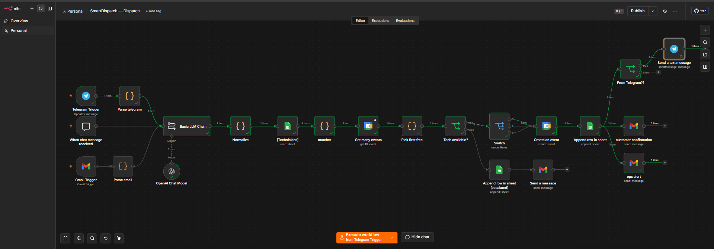

# SmartDispatch — AI Field-Service Triage, Dispatch & Auto-Invoice

**A customer texts "AC not blowing cold air, burning smell" at 11pm. Normally that's 15 minutes
of manual triage the next morning.** SmartDispatch turns it into a booked job in seconds: it reads
the message on whatever channel it arrives, classifies the urgency, matches a technician by area +
skill + live calendar availability, books the slot, confirms the customer, escalates to a human when
no one is free — and when the tech later texts "Done, replaced the capacitor," it prices the job and
sends the invoice.

Two small n8n workflows, one Google Sheet as the job database, `gpt-4o-mini` as the brain.

> 📖 **[WALKTHROUGH.md](WALKTHROUGH.md)** explains every node in both workflows, line by line.

*The Dispatch workflow: three intake channels (Telegram / chat / Gmail) merge into one brain, then
match → book → notify, with a parallel escalation path when no tech is free.*

---

## Why this exists

**The problem —** home-services businesses (HVAC, plumbing, electrical) live and die by response
time. A request comes in by text, email, or a chat widget; someone has to read it, judge how urgent
it is, work out which tech covers that area and skill, check who's actually free, book it, tell the
customer, and — hours later — write up the invoice. Every step is manual, and the emergency jobs are
exactly the ones you can't afford to leave sitting in an inbox overnight.

**The result —** the message *is* the dispatch. "Aircon not cooling in Makati, burning smell, I'm Ana
09171234567" arrives → within seconds it's classified **Emergency**, matched to the aircon tech who
covers Makati and has a free slot, booked on that tech's calendar, and Ana gets a confirmation back
on the same channel she messaged from. If no tech is free, it doesn't silently drop — it escalates to
the ops inbox for manual assignment.

---

## What it does

**Dispatch workflow** (`workflows/SmartDispatch-Dispatch.json`)

- **Listens on three channels** into one shared brain — a **chat** widget, **Gmail** (a labelled
  inbox), and **Telegram**.
- **Classifies** each request with `gpt-4o-mini`: urgency (`Emergency` / `Within-24h` / `This-week`),
  a canonical `skill_required`, and the customer's name / contact / address / email — flagging
  anything missing instead of inventing it.
- **Matches** a technician by **area + skill**, then checks **live Google Calendar availability** and
  picks the first genuinely free tech.
- **Books** the slot on that tech's calendar and logs the job to the Sheet as `BOOKED`.
- **Notifies** in parallel: customer confirmation + an ops alert, and — for Telegram customers — a
  reply straight back into the chat.
- **Escalates** cleanly when nobody matches or everyone's busy: the job is logged `ESCALATED` and an
  ops alert goes out for manual assignment.

**Completion workflow** (`workflows/SmartDispatch-Completion.json`)

- **Parses** a technician's free-text "Done" message (`gpt-4o-mini`).
- **Finds** the matching open job in the Sheet, marks it `DONE`.
- **Prices** it from a simple rate card (base call-out + urgency premium + parts).
- **Invoices** the customer with an itemised HTML email, then marks the job `INVOICED`.

---

## The stack

| Piece | Used for |
|---|---|
| **n8n** | orchestration (two workflows sharing one Sheet) |
| **gpt-4o-mini** | urgency + skill classification, completion parsing |
| **Google Sheets** | the job database — `Technicians` roster + `Jobs` lifecycle |
| **Google Calendar** | per-technician availability + booking |
| **Gmail / Telegram / Chat** | multi-channel intake + notifications |

**Job lifecycle:** `NEW → BOOKED → DONE → INVOICED`, with `ESCALATED` as the no-tech branch.

---

## Design decisions worth calling out

- **One channel-agnostic brain.** Chat, Gmail, and Telegram each normalise into a single `chatInput`
  field, so all three feed the *same* LLM node with no per-channel branching. Adding a fourth channel
  is one mapper node, not a second pipeline.
- **The LLM maps messy language → a fixed vocabulary; code does the exact match.** Customers write
  "air conditioner," "AC," "my unit" — never your internal tag `aircon`. Rather than maintain a
  brittle synonym list in code, the brain emits a canonical `skill_required` enum and the matcher does
  a clean exact match. (This was a real bug the walkthrough documents.)
- **Empty items can't drive a branch, so every decision node emits exactly one tagged item.** n8n
  skips a node that receives zero items — which means an empty result can't trigger an escalation
  branch. Both decision points always emit one item carrying an `_escalate` flag, and an `If` routes
  on it.
- **Escalation is a first-class path, not an error.** No-match and all-busy both land as logged,
  actioned outcomes — never a silent dead end.

---

## Sanitisation

The workflow JSON in this repo is sanitised for public sharing — Sheet IDs, the Gmail label ID, and
the owner email are replaced with `YOUR_SHEET_ID` / `YOUR_GMAIL_LABEL_ID` / `you@example.com`.
n8n workflow exports never contain credential secrets (only credential *references*), so no API keys
or tokens are present. Per-technician calendar IDs live in the Sheet, not the workflow.

To run it yourself: import both JSONs, reconnect the Google / OpenAI / Gmail / Telegram credentials,
create the two-tab Sheet (see the walkthrough), and point the IDs at your own resources.
