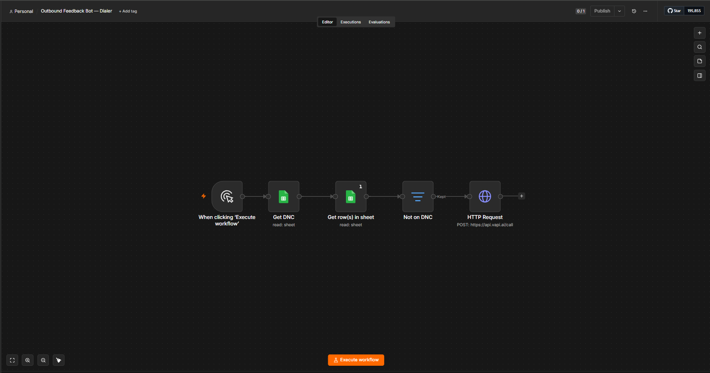
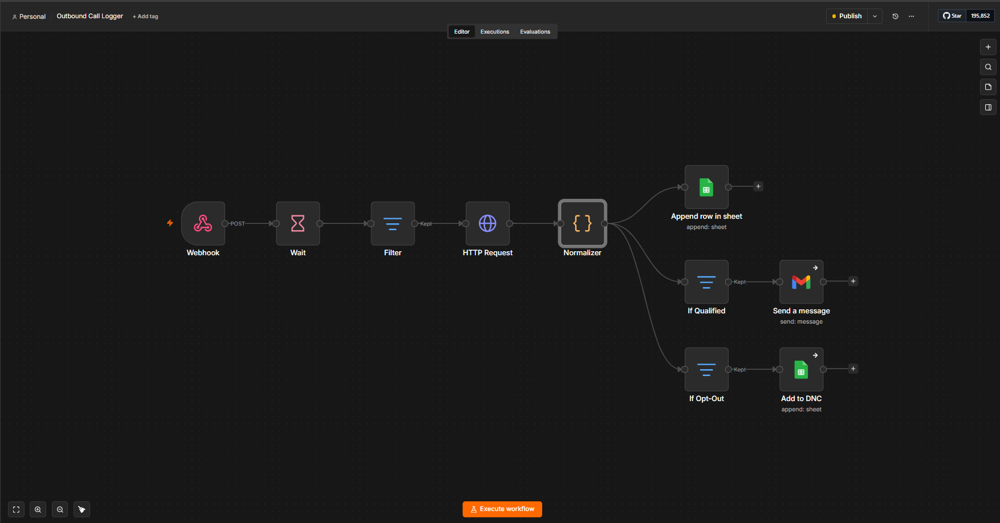

# Outbound Feedback Bot (Vapi + n8n + Twilio)

An AI **voice** agent that calls a company's existing customers, checks in on their last
purchase, **reads their sentiment**, **qualifies new opportunities**, and hands the results
back to the sales team — **logging every call** to a spreadsheet and **emailing only the
qualified leads** to the rep's inbox. Opt-out requests are honored automatically: the
customer is added to a Do-Not-Call list and never dialed again.

Built as a real pilot for a B2B "customer reactivation / feedback" use case (Australian
market), not a toy demo — every call is placed over a real phone number, recorded, and
turned into structured CRM-ready data with zero manual data entry.

---

## What it does

**📞 Places the call**
- Reads a "Customers to Call" sheet (name, business, phone, email) and dials each lead over
  a real phone number via Vapi + Twilio.
- Greets each customer **by name** and opens as a warm follow-up, not a cold call.

**🗣️ Runs the conversation ("Alex")**
1. Confirms it's the right person.
2. Asks how their last order went, and reads sentiment (**happy / neutral / unhappy / unclear**).
3. Asks about current needs or upcoming changes.
4. If there's an opportunity, **qualifies it** — product, quantity, budget, timeframe,
   location, preferred follow-up method.
5. Asks who their previous rep was and whether they'd like them to follow up.
6. Wraps up politely if they're not interested.

**🧾 Turns the call into data**
- A post-call LLM pass extracts **14 structured fields** + a written summary.
- **Every call** is appended to a Google Sheet (the system of record): sentiment,
  opportunity details, outcome tag, transcript, and recording link.
- **Only qualified leads** (`hot` / `warm` / `future`) trigger an **HTML lead-summary email**
  to the rep — so the inbox stays signal, not noise.

**🚫 Honors opt-outs (compliance built in)**
- If a customer says "take me off your list," the agent stops immediately and the call is
  tagged `opt_out`.
- The logger **auto-adds that number to a Do-Not-Call sheet**.
- Before dialing, the dialer **checks the DNC list and skips anyone on it** — so an opt-out
  is permanent and hands-off.

---

## How it's built

```
                 ┌─────────────── Google Sheets (system of record) ───────────────┐
                 │  Customers to Call │ Outbound Call Log │ Do Not Call            │
                 └────────────────────────────────────────────────────────────────┘
   Workflow 1 — DIALER
   Manual Trigger ─▶ Get DNC ─▶ Get leads (Execute Once) ─▶ Not on DNC (filter)
                                                                   │
                                                                   ▼
                                                     POST api.vapi.ai/call  ──▶  📞 Vapi + Twilio
                                                                                     │ (call happens)
   Workflow 2 — LOGGER                                                               ▼
   Webhook ◀──────────────── Vapi end-of-call report ◀───────────────────────────────┘
      │
      ▼
   Wait ─▶ Filter(end-of-call) ─▶ GET call data ─▶ Normalizer ─┬─▶ Append row (every call)
                                                               ├─▶ If Qualified ─▶ Send email
                                                               └─▶ If Opt-Out  ─▶ Add to DNC
```

Two n8n workflows, cleanly split by job:
- **Outbound Dialer** — reads the list, suppresses DNC numbers, places the calls.
- **Outbound Call Logger** — receives Vapi's end-of-call report and fans it out to the sheet,
  the email, and (on opt-out) the Do-Not-Call list.

See **[WALKTHROUGH.md](WALKTHROUGH.md)** for a node-by-node explanation of both.

**Workflow 1 — Outbound Dialer**



**Workflow 2 — Outbound Call Logger**



## Stack

| Layer | Tool |
|---|---|
| Voice agent | **Vapi** (gpt-4o-mini · Deepgram Nova-2 · ElevenLabs Charlie AU) |
| Telephony | **Twilio** number (BYO into Vapi) |
| Orchestration | **n8n** (self-hosted, Docker) |
| System of record | **Google Sheets** |
| Notifications | **Gmail** (HTML lead email) |

## Requirements coverage

This build was scoped against a real job posting; it covers the full spec:

- ✅ Calls **existing** customers (warm, not cold)
- ✅ Captures **sentiment** (happy / neutral / unhappy / unclear)
- ✅ Asks about needs + upcoming changes
- ✅ **Qualifies opportunities** (product, quantity, budget, timeframe, location, follow-up)
- ✅ Captures **prior rep** + whether they want that rep to follow up
- ✅ Polite exit if not interested
- ✅ **Opt-out / do-not-call** tracking (suppress before dial + auto-add on opt-out)
- ✅ **Emails a lead summary** to the rep's inbox (qualified only)
- ✅ **Logs every call** to Google Sheets (with transcript + recording link)
- ✅ Outcome **tags**: hot / warm / future / feedback-only / not-interested / do-not-call

## Files

```
outbound-feedback-bot/
├── README.md                      ← you are here
├── WALKTHROUGH.md                 ← node-by-node explanation of both workflows
├── prompts/
│   └── assistant-config.md        ← Vapi model/voice, first message, system prompt, output schema
├── workflows/
│   ├── 1-outbound-dialer.json     ← import into n8n
│   └── 2-outbound-call-logger.json
└── docs/                          ← workflow canvas screenshots
```

## Notes

- **Demo caller ID:** the demo uses a BYO Twilio US number; a production deployment for an
  Australian client would rent a dedicated **Australian** number so the caller ID reads local.
- **CRM sync** (HubSpot/Pipedrive/etc.) is a natural add-on but intentionally out of scope for
  the pilot — the Google Sheet is the system of record.
- Credentials, phone numbers, sheet IDs and the assistant ID are replaced with placeholders in
  the exported workflows.
