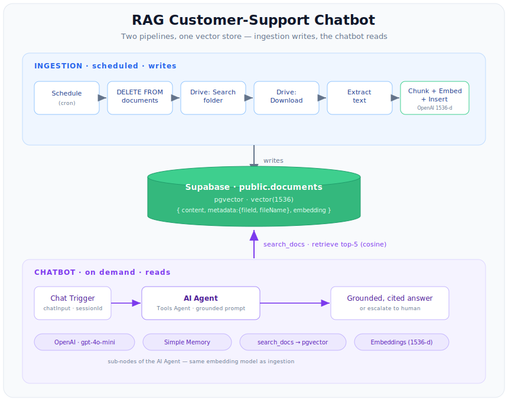
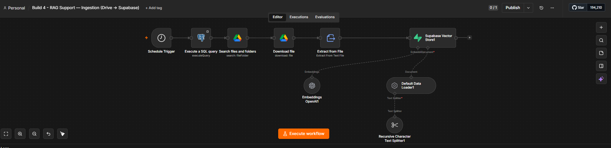
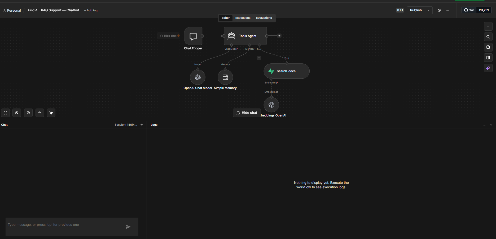
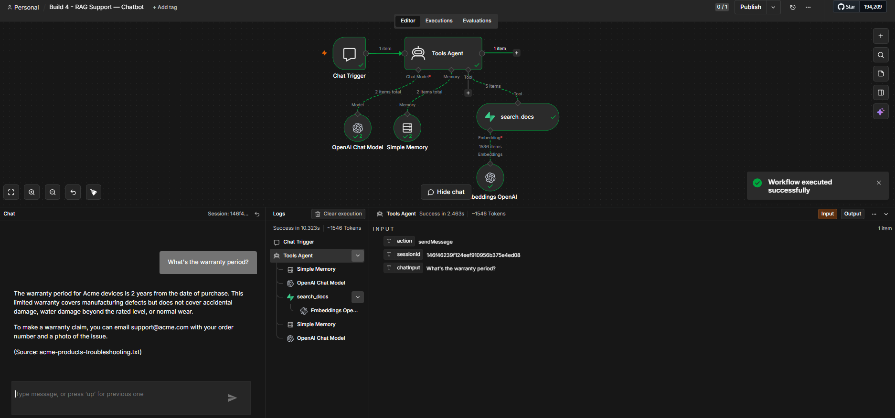
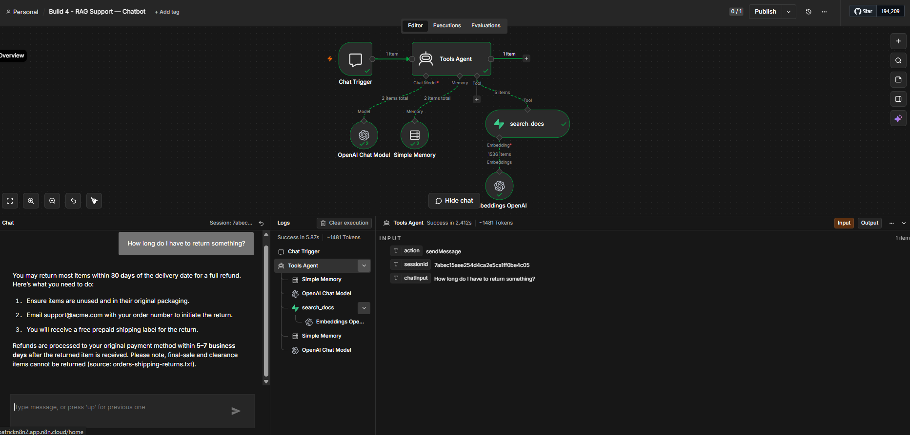

# RAG Customer-Support Chatbot (n8n + AI)

A support chatbot that **answers only from your own documentation** — and keeps
itself up to date automatically. Drop a file into a Google Drive folder and,
within the poll interval, it's chunked, embedded, and instantly answerable in
chat — with the **source file cited** on every answer.

It's built as **two pipelines sharing one vector store**:

- **Ingestion** — watches a Drive folder, then chunks → embeds → stores the docs in Supabase.
- **Chatbot** — a retrieval-augmented agent that searches that store and answers, grounded in the docs.

Because answers are grounded, the bot **refuses to guess**: if the docs don't
cover a question, it says so and offers to escalate to a human — exactly the
behaviour you want from support automation.

Build 4 of a six-build AI automation portfolio.

> 📖 **[WALKTHROUGH.md](WALKTHROUGH.md)** explains every node in both workflows, step by step.

---

## What it does

- **Auto-syncs a knowledge base** from a Google Drive folder on a schedule.
- **Chunks + embeds** each document (recursive splitter, 800 / 100) so retrieval is precise.
- **Answers from retrieval only** — a Tools Agent decides when to search and can do multi-hop lookups.
- **Cites its source** — every answer names the file it came from.
- **Refuses out-of-scope questions** — no hallucinated answers; offers human escalation.
- **Remembers the conversation** — follow-up questions resolve against earlier turns.
- **Stays clean on every run** — wipes and reloads the table so chunks never duplicate (and deleted files drop out).

---

## Architecture



```
INGESTION  (scheduled — writes)
  Schedule
    → Postgres: DELETE FROM documents        (wipe, so re-runs don't duplicate)
    → Google Drive: Search files and folders (list the watched folder)
    → Google Drive: Download                 (fetch each file's bytes)
    → Extract from File                      (binary → text, field: data)
    → Supabase Vector Store: Add documents
         ├─ Default Data Loader   (content = text; metadata = fileId + fileName)
         ├─ Recursive Text Splitter (800 / 100)
         └─ Embeddings OpenAI     (text-embedding-3-small → 1536-d)

                    ▼ writes
        ┌─────────────────────────────────┐
        │  Supabase · public.documents     │
        │  pgvector(1536)                  │
        │  { content, metadata, embedding }│
        └─────────────────────────────────┘
                    ▲ search_docs (retrieve top-5, cosine)

CHATBOT  (on demand — reads)
  Chat Trigger
    → AI Agent (Tools Agent, grounded prompt)
         ├─ OpenAI Chat Model     (gpt-4o-mini)
         ├─ Simple Memory         (per-session conversation)
         └─ Supabase Vector Store as Tool  (search_docs, top-5)
              └─ Embeddings OpenAI (text-embedding-3-small — MUST match ingestion)
```

### The one rule that makes RAG work

**Use the exact same embedding model on both sides.** Ingestion and retrieval
both use `text-embedding-3-small`. Embed with one model and query with another
and you get silently-wrong results — the vectors live in different spaces. The
table's `vector(1536)` dimension is tied to this model too.

---

## Screenshots

**Ingestion workflow** — Schedule → wipe → Drive search → download → extract → embed → Supabase:



**Chatbot workflow** — Chat Trigger → AI Agent with chat model, memory, and the `search_docs` retrieval tool:



**Grounded answers — every claim cites its source file:**





---

## Tech stack

- **n8n** (cloud or self-hosted) — orchestration
- **OpenAI** — `gpt-4o-mini` (chat) + `text-embedding-3-small` (embeddings)
- **Supabase** (Postgres + **pgvector**) — the shared vector store
- **Google Drive** — the document source (auto-synced)

---

## Setup

1. **Create the table** — run [`sql/schema.sql`](sql/schema.sql) in Supabase's SQL
   Editor. It enables `pgvector`, creates `documents` (`vector(1536)`), and the
   `match_documents` search function. (Annotated version:
   [`sql/schema-explained.sql`](sql/schema-explained.sql).)
2. **Import both workflows** into n8n (`Workflows → ⋯ → Import from File`):
   - [`workflows/ingestion.json`](workflows/ingestion.json) — the Drive → Supabase sync
   - [`workflows/chat.json`](workflows/chat.json) — the chatbot
3. **Create credentials** and select them on each node — the JSON ships with
   `REPLACE_WITH_YOUR_*_CREDENTIAL` placeholders:
   - **OpenAI** (chat model + both Embeddings nodes)
   - **Supabase** (Vector Store nodes) and **Postgres** (the `DELETE` query node) —
     point Postgres at your Supabase **Session Pooler** (IPv4; the direct
     `db.<ref>.supabase.co` host is IPv6-only and won't reach cloud runners)
   - **Google Drive** (Search + Download)
4. **Point it at your folder** — in the *Search files and folders* node, set the
   **Folder** filter to your support-docs folder (replaces `YOUR_DRIVE_FOLDER`).
5. **The grounding prompt** lives in
   [`prompts/grounding-prompt.txt`](prompts/grounding-prompt.txt) so you can tune it
   without opening the JSON.

> ⚠️ **Don't leave the ingestion schedule on a one-minute interval in production**
> — each run re-embeds the whole folder. Widen the interval (e.g. hourly), or
> switch to per-file dedup (delete by `metadata->>'fileId'` before insert) if your
> corpus is large.

---

## Try it

Put a few `.txt` support docs in the Drive folder and run the ingestion workflow
once. Then open the chatbot's chat panel and ask:

```
How long do I have to return something?      → grounded answer, cites the orders doc
How do I reset my password?                  → grounded answer, cites the account doc
Do you sell gaming laptops?                  → "not in the docs" + offers to escalate
```

The third one is the point: a support bot that **won't make things up**.

---

## Security notes

- **No secrets in this repo.** n8n exports *reference* credentials by name only —
  no API keys. Credential IDs, instance IDs, the Drive folder id, and any project
  refs are replaced with placeholders.
- **The table is backend-only.** RLS is enabled; n8n connects with the
  Postgres/service-role user (which bypasses RLS), so nothing is exposed to the
  public `anon` key.
- **Grounding is a safety feature.** The agent answers only from retrieved docs
  and escalates otherwise — it can't leak or invent information that isn't in your
  knowledge base.

---

## Roadmap

Build 4 of a six-build n8n AI automation portfolio:

1. MCP personal assistant ✅
2. Competitor intelligence tracker ✅
3. WhatsApp lead-qualification agent ✅
4. **RAG customer-support chatbot** ✅ (this repo)
5. Social-media content bot
6. AI email-triage agent

---

## License

MIT — see `LICENSE` (add your preferred license file).
