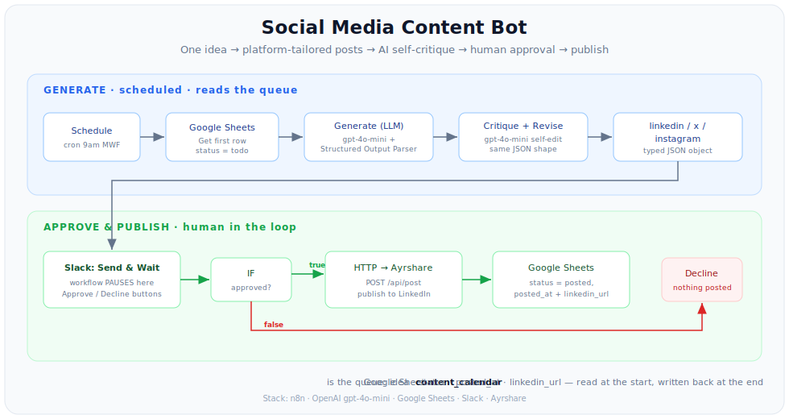
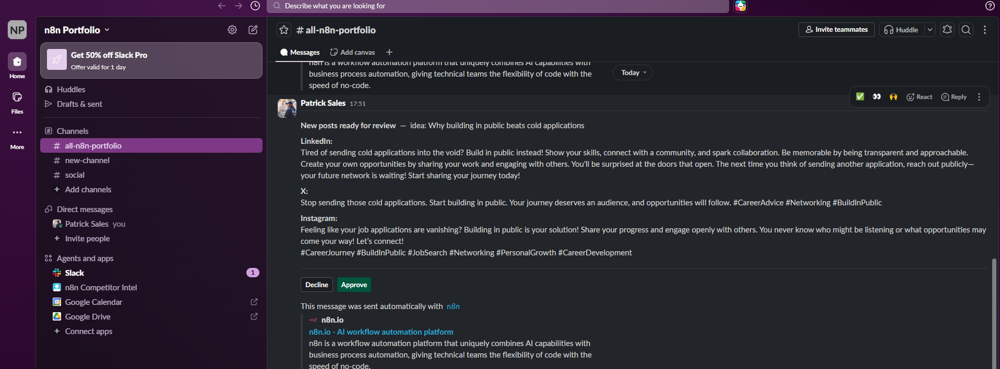
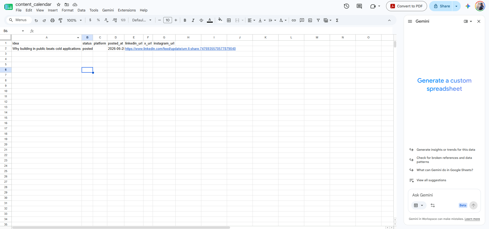
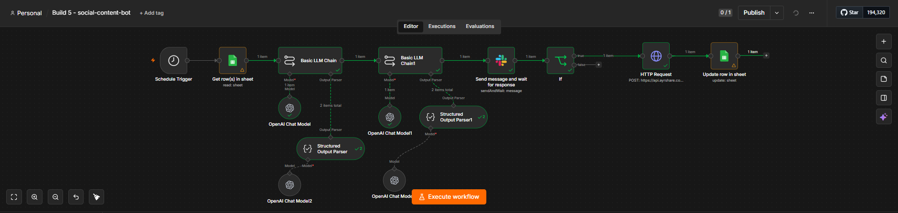
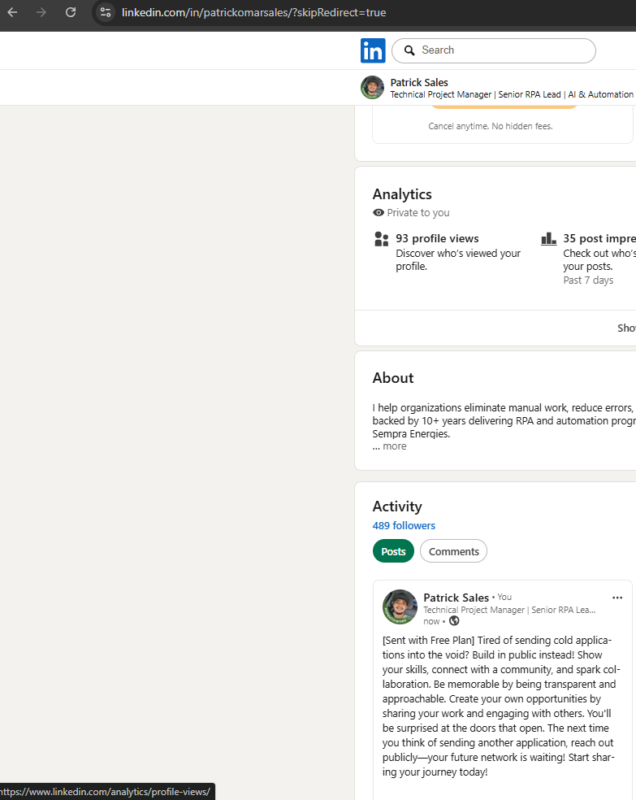

# Social Media Content Bot (n8n + AI)

A scheduled bot that turns **one idea into platform-tailored posts**, runs an AI
**self-critique pass** for quality, routes everything through a **human approval
gate in Slack**, then **publishes** and logs the result — with a link back to the
live post.

The human approval gate is the whole point: nothing goes public until a person
clicks **Approve** in Slack. The workflow literally *pauses* mid-execution and
resumes on the click — so you get automation speed with a human's final say.

Build 5 of a six-build AI automation portfolio.

> 📖 The two prompts that drive quality live in
> [`prompts/generate.txt`](prompts/generate.txt) and
> [`prompts/critique.txt`](prompts/critique.txt) so you can tune voice without
> opening the JSON.

---

## Why this exists

**The problem —** posting consistently across platforms is a grind, and naive
"AI autoposters" make it worse: they fire off generic, off-brand, sometimes
embarrassing content with no review step. The risk of an automated bad post is
exactly why most people won't hand the keys to automation.

**The result —** a content engine that drafts *platform-specific* copy, edits its
own work, and then **stops and asks a human** before anything is published. Approve
and it posts + logs the live URL; decline and nothing ships. Speed where it's safe,
a human gate where it matters.

---

## What it does

- **Runs from a content queue** — reads the next `todo` idea from a Google Sheet on a schedule.
- **Generates per-platform posts** — one LinkedIn / X / Instagram object, each respecting its own length and tone, via a **Structured Output Parser** (clean, typed JSON every time).
- **Self-critiques and rewrites** — a second LLM pass scores each draft and fixes its weakest dimension. The single biggest quality lift over one-shot generation.
- **Pauses for human approval** — Slack **Send and Wait for Response** suspends the workflow until someone clicks Approve / Decline.
- **Publishes on approval** — posts to LinkedIn (and other platforms) via the Ayrshare API.
- **Logs the outcome** — marks the row `posted`, stamps `posted_at`, and writes the live post URL back to the sheet. Declines leave the row untouched (or mark `rejected`).

---

## Architecture



```
GENERATE  (scheduled — reads the queue)
  Schedule (cron 9am Mon/Wed/Fri)
    → Google Sheets: Get first row where status = todo
    → Basic LLM Chain  (gpt-4o-mini + Structured Output Parser)   generate variants
    → Basic LLM Chain  (gpt-4o-mini + Structured Output Parser)   critique + revise
         → { linkedin{text,hook}, x{text}, instagram{caption,hashtags[]} }

APPROVE & PUBLISH  (human in the loop)
  Slack: Send and Wait for Response   ← workflow PAUSES (Approve / Decline)
    → IF approved?
        ├─ true  → HTTP Request → Ayrshare  (POST /api/post, publish to LinkedIn)
        │            → Google Sheets: Update Row (status=posted, posted_at, linkedin_url)
        └─ false → (nothing published; optionally mark status=rejected)
```

## Screenshots

**The workflow** — Schedule → Sheets queue → generate → critique → Slack approval → IF → Ayrshare → log:



**The human gate** — drafts posted to Slack with Approve / Decline buttons; the workflow stays paused until a click:



**Closed loop** — on approval, the row is marked `posted` with the live post URL written back:



**The result** — the approved post, live on LinkedIn:



---

### The two ideas that make this work

1. **Structured output, not prose.** Each platform gets its own object with its own
   limits, so the publish step can read `output.linkedin.text` reliably instead of
   regex-scraping a blob. The parser's **Auto-Fix** retry coerces the occasional
   malformed response back into valid JSON.
2. **Pause, don't just notify.** Slack *Send and Wait* truly suspends the execution
   and resumes on the button click — a real approval gate, not a fire-and-forget
   ping. On **Publish**, n8n auto-registers the resume webhook so approvals work even
   when the editor is closed.

---

## Tech stack

- **n8n** (cloud or self-hosted) — orchestration
- **OpenAI** — `gpt-4o-mini` for generation, critique, and parser auto-fix
- **Google Sheets** — the content queue + post log (`content_calendar`)
- **Slack** — the human approval gate (Send and Wait for Response)
- **Ayrshare** — one API to publish across social platforms (X has no usable free write tier; Ayrshare routes it)

---

## Setup

1. **Create the content queue** — a Google Sheet named `content_calendar` with columns:
   `idea | status | platform | posted_at | linkedin_url | x_url | instagram_url`.
   Seed a few rows with `status = todo`.
2. **Import the workflow** into n8n (`Workflows → ⋯ → Import from File`):
   [`workflows/social-content-bot.json`](workflows/social-content-bot.json).
3. **Create credentials** and select them on each node — the JSON ships with
   `REPLACE_WITH_YOUR_*_CREDENTIAL` placeholders:
   - **OpenAI** (all four chat-model nodes — two chains + two parser auto-fix models)
   - **Google Sheets** (the Get Rows + Update Row nodes) → point at `YOUR_SHEET_ID`
   - **Slack** (Send and Wait) → set the channel (`YOUR_SLACK_CHANNEL_ID`)
   - **Ayrshare** (HTTP Request) → a **Header Auth** credential:
     Name `Authorization`, Value `Bearer YOUR_AYRSHARE_API_KEY`
4. **Connect your socials in Ayrshare** — sign up, link LinkedIn (and any others)
   in their dashboard, copy your API key into the Header Auth credential above.
5. **Tune the voice** — edit [`prompts/generate.txt`](prompts/generate.txt) (brand
   voice + per-platform spec) and [`prompts/critique.txt`](prompts/critique.txt).
6. **Publish** to activate the schedule and enable the Slack approval webhook.

> 💡 **Instagram needs an image** on most posters — text-only IG posts often fail.
> Add a media URL to the Ayrshare body, or publish LinkedIn + X only. This export
> publishes LinkedIn by default (`"platforms": ["linkedin"]`).

---

## Try it

1. Put one idea in the sheet with `status = todo`.
2. Run the workflow (Execute, or wait for the cron).
3. It generates + critiques, then **pauses** — check your Slack channel for the
   drafts with **Approve / Decline** buttons.
4. Click **Approve** → it publishes to LinkedIn and the sheet row flips to
   `posted` with the live `linkedin_url`. Click **Decline** → nothing ships.

The pause is the demo: automation that knows when to stop and ask.

---

## Security notes

- **No secrets in this repo.** n8n exports *reference* credentials by name only —
  no API keys. Credential IDs, the instance ID, the Sheet ID, the Slack channel,
  and the Slack webhook ID are replaced with placeholders / regenerated.
- **The Ayrshare key lives in a credential**, never in the node body — so it's not
  in the exported JSON.
- **The human gate is a safety feature.** Publishing is gated behind an explicit
  Approve click; a Decline (or no response) publishes nothing.

---

## Results & highlights

- **Human-gated autoposting** — the standout pattern: real approval (pause/resume),
  not a notification you can ignore. Decline = nothing ships.
- **Platform-aware, not copy-paste** — distinct LinkedIn / X / Instagram treatments
  from a single idea, each within its own limits.
- **Self-editing quality loop** — the critique pass measurably tightens hooks and
  trims fluff before a human ever sees the draft.
- **Closed-loop logging** — every approved idea is marked posted with a clickable
  link back to the live post, so the sheet doubles as a publishing record.
- **Portable** — swap the brand-voice prompt and the connected socials and the same
  engine works for any brand or creator.

> 🎥 A short demo video is coming once all six builds are complete.

---

## Roadmap

Build 5 of a six-build n8n AI automation portfolio:

1. MCP personal assistant ✅
2. Competitor intelligence tracker ✅
3. WhatsApp lead-qualification agent ✅
4. RAG customer-support chatbot ✅
5. **Social-media content bot** ✅ (this repo)
6. AI email-triage agent

---

## License

MIT — see `LICENSE` (add your preferred license file).
