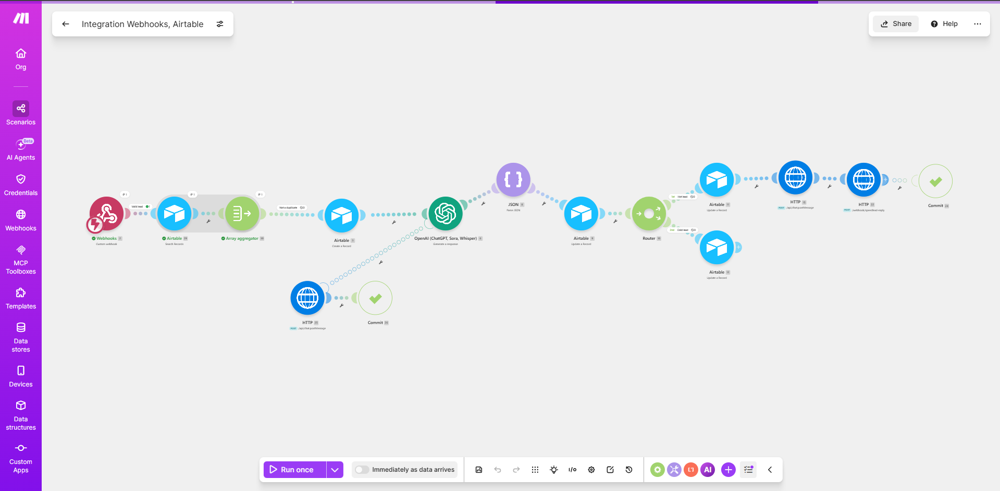
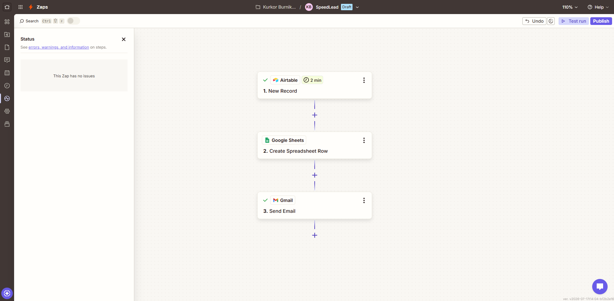

# SpeedLead — Node-by-Node Walkthrough

This walks the **Make scenario** module by module, in execution order, then the **Zapier
companion** step by step. Module numbers match the ids in
[`workflows/speedlead.make.blueprint.json`](workflows/speedlead.make.blueprint.json).

The through-line: **capture a lead safely, score it, and respond fast — without ever losing one
to a bad payload, a double-submit, or an AI outage.**



---

## Make scenario

### 2 · Webhook — `speedlead-intake` (trigger)
`gateway:CustomWebHook`

The front door. A website form POSTs JSON here; Make learned the shape from a sample so it exposes
seven fields as mappable pills: `name`, `email`, `phone`, `company`, `message`, `source`,
`submitted_at`. In production a Tally/Jotform/HTML form hits this URL; in development a PowerShell
`Invoke-RestMethod` fires precise test payloads. The webhook URL is the contract — nothing
downstream cares which front-end called it.

> **Link filter — "Valid lead"** (between 2 → 29)
> Two conditions, both required:
> - `email` **matches pattern** `^[^@\s]+@[^@\s]+\.[^@\s]+$`
> - `message` **exists**
>
> Malformed or empty payloads stop right here — no CRM row, no AI spend. *Validate at the door.*

### 29 · Airtable — Search Records (dedup lookup)
`airtable:ActionSearchRecords`

The first half of idempotency. Searches `Leads` with:

```
AND({Email} = "{{2.email}}", IS_AFTER({Submitted At}, DATEADD(NOW(), -10, 'minutes')))
```

i.e. *"is there already a record with this email from the last 10 minutes?"* Limit 1. A match means
this is a duplicate submit or a platform retry.

> **Gotcha:** the connection PAT needs `data.records:**read**`. It was first created write-only, so
> this Search returned Airtable `[403]` — which Make surfaces with a *misleading* "model not found"
> string that looks like an OpenAI error. Tell: the run dies at 2 operations, never reaching OpenAI.

### 30 · Aggregator → `id`
`builtin:BasicAggregator`

Collapses the Search output (0 or 1 records) into a single bundle carrying `id = {{29.id}}`. This
exists to **un-halt the flow**: a Search that finds nothing would otherwise stop everything
downstream. The aggregator guarantees exactly one bundle continues, so a *non*-duplicate still
proceeds to capture.

> **Link filter — "Not a duplicate"** (between 30 → 3)
> Condition: `{{30.array[].id}}` **does not exist**.
>
> **The subtle bug this dodges:** an Aggregator over 0 results still emits a *phantom* element with
> an empty `id`, so `length(array) = 0` never passes and would block every lead. Gating on the `id`
> being does-not-exist (Make treats empty string as does-not-exist) is the correct test: empty `id`
> → new lead → pass; `recXXX` → duplicate → stop.

### 3 · Airtable — Create Record (capture)
`airtable:ActionCreateRecord`

Writes the lead immediately with `Status = New` and all seven inbound fields mapped from the
webhook (module 2) pills. **This is capture-first:** the row exists before the AI runs, so if
scoring fails the lead is still safe. `Score` / `Intent` / `AI Summary` are left blank for the
enrich step.

### 6 · OpenAI — Generate a response (the scoring brain)
`openai-gpt-3:createModelResponse`

`gpt-4o-mini`, temperature `0.2`, max 300 tokens, **Output Format = JSON object**. The prompt
([`prompts/scoring-prompt.txt`](prompts/scoring-prompt.txt)) asks for a 1–10 hotness score and
returns strict JSON: `{ "score", "intent", "summary" }`. Lead data is injected as pills from the
**webhook** module, not typed literally.

> **onerror handler (Handler 2 of 2):**
> - **25 · HTTP → Slack `chat.postMessage`** — posts *"⚠️ AI SCORING FAILED — {name} at {company}
>   … needs manual review"*. Pills come from the **webhook** group here (Parse JSON hasn't run on a
>   failure).
> - **26 · Commit** — forces the run to succeed so the captured `Status=New` row is preserved.
>
> Net effect: *an AI outage never loses a lead — a human is pinged to score it manually.*

> **Gotcha:** the output text lives at `Result → Raw Result`, **not** `choices[].message.content`
> — this is the Responses API module, not the deprecated Chat Completions one.

### 8 · Parse JSON
`json:ParseJSON`

Turns the model's raw JSON string into real fields (`score`, `intent`, `summary`) so downstream
modules can map them as typed pills. Data structure is left empty — Make learns it on the first run.

### 9 · Airtable — Update Record (enrich)
`airtable:ActionUpdateRecords`

Re-opens the row created in module 3 (**Record ID = `{{3.id}}`** — the make-or-break mapping) and
writes `Score` / `Intent` / `AI Summary` from the **Parse JSON** module (lowercase
`{{8.score}}` etc.), **not** from the Create module's own blank fields.

### 10 · Router
`builtin:BasicRouter`

Forks on the score.

#### HOT route — score ≥ 7
- **11 · Airtable Update — "Hot lead"** → `Status = Hot` (Record ID `{{3.id}}`).
  > Filter uses a **numeric** `≥ 7`. As a string, `"10"` sorts below `"7"` and hot leads route cold.
- **15 · HTTP → Slack `chat.postMessage`** → the fully-populated hot-lead alert to
  `#speedlead-channel`. `application/x-www-form-urlencoded` body (so quotes/newlines in the summary
  can't break it), `Authorization: Bearer xoxb-…` header, **No auth** at the Make connection level.
- **22 · HTTP → n8n reply webhook** → POSTs the lead (form-urlencoded) to
  `…/webhook/speedlead-reply` on a self-hosted n8n, which sends the instant Gmail reply to the lead.
  Make can't send Gmail (broken OAuth + blocked SMTP), so it hands the send to n8n.
  > **onerror (Handler 1 of 2): 24 · Commit** — a reply-call failure (n8n cold start / bad path) is
  > swallowed; the run still logs SUCCESS and the upstream Airtable-Hot + Slack alert are preserved.
  > Make's default is Rollback, which would have thrown all three away.

#### COLD route — fallback
- **12 · Airtable Update — "Cold lead"** → `Status = Nurture` (Record ID `{{3.id}}`).

---

## Zapier companion

No clean export exists, so this half is documented via screenshots. It does the
**CRM-logging + team-notification** work, complementing Make's instant response.



### Trigger · Airtable — New Record in View
Watches a filtered `Hot Leads` grid view (`Status is Hot`). Zapier free has no webhooks, so a native
app trigger is used. Zapier is a Google-/Airtable-verified app, so these OAuth connections — unlike
Make's — connect cleanly.

### Action 1 · Google Sheets — Create Spreadsheet Row
Appends the hot lead to `SpeedLead Hot Leads Log` (Name / Email / Phone / Company / Score / Intent /
AI Summary / Submitted At / **Logged At**). `Logged At` uses Zapier's `{{zap_meta_human_now}}`.

> **Gotcha:** `+61 400 111 222` came back as `#ERROR!` — Sheets reads a leading `+` as a formula.
> Fix: prepend a single apostrophe (`'`) to the Phone mapping to force text; the apostrophe stays
> hidden in the cell.

### Action 2 · Gmail — Send Email (owner alert)
Sends an internal *"🔥 New hot lead"* summary to the business owner — **distinct** from Make's
customer-facing reply to the lead. One event, two audiences: the lead gets a reply, the owner gets a heads-up.

---

## The two-platform story in one line

**Make** owns the real-time path — capture, validate, dedup, score, route, respond.
**Zapier** owns the record-keeping path — log the hot lead, notify the team.
Each does the half it's best at, and neither is a single point of failure for the other.
