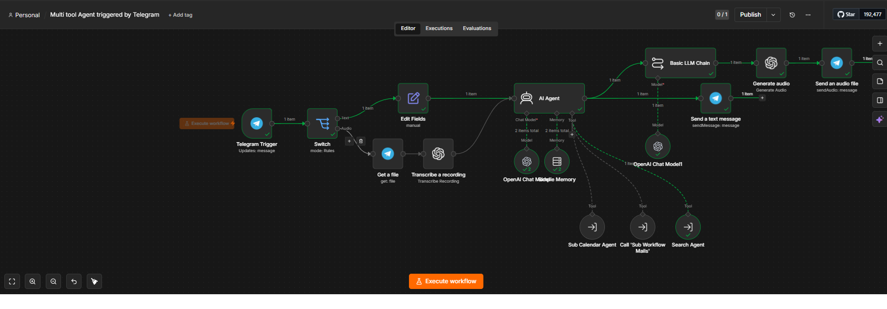

# 🤖 Multi-Tool Telegram AI Agent

A production-ready AI agent built in n8n that handles both text and voice 
messages via Telegram, routes them intelligently, and responds using 
multi-tool function calling with persistent memory.

> 📖 **[WALKTHROUGH.md](WALKTHROUGH.md)** explains every node, line by line.

---

## 💡 Why This Exists

**The problem —** quick tasks (check the calendar, fire off an email, look something
up) are annoying to do from your phone, and typing them out is slower than just
*saying* them — especially on the move.

**The result —** a personal assistant that lives in Telegram and takes **voice or
text**. Send a voice note, it transcribes it with Whisper, figures out which tool to
call, does the work, and replies — by text or generated audio — all from a chat you
already have open.

---

## 🧠 What It Does

- Accepts **text and voice messages** from Telegram
- Transcribes voice notes via OpenAI Whisper
- Routes messages through a **Switch node** (text vs. audio path)
- Passes input to an **AI Agent** with memory and tool access
- Responds via **text or generated audio** back to Telegram

---

## 🛠 Tools Available to the Agent

| Tool | Purpose |
|------|---------|
| Sub Calendar Agent | Read/write Google Calendar events |
| Call 'Sub Workflow Mails' | Send and read emails |
| Search Agent | Web search via SerpAPI or similar |

---
## 📸 Workflow Screenshot

---

## 🎬 Demo

A live run — a Telegram message routes through the agent to the right tool
(calendar / email / web search) and the reply lands right back in the chat.

## ⚙️ Tech Stack

- **Platform:** n8n (self-hosted / cloud)
- **LLM:** OpenAI GPT-4o
- **Memory:** n8n Simple Memory
- **Voice:** OpenAI Whisper (transcription) + TTS (audio reply)
- **Trigger:** Telegram Bot API

---

## 🚀 How to Use

1. Import `workflows/multi-tool-telegram-agent.json` into your n8n instance
2. Set credentials: Telegram Bot, OpenAI, Gmail/Calendar
3. Activate the workflow
4. Message your Telegram bot

---

## ✨ Results & Highlights

- **Voice-first** — speak instead of type; Whisper transcription makes it hands-friendly.
- **One agent, many tools** — calendar, email, and web search behind a single chat, with
  the agent routing each request to the right sub-workflow itself.
- **Replies in kind** — answers by text or generated audio, right inside Telegram.
- **Persistent memory** — follow-up messages resolve against the running conversation.

---

## 👤 Author

**Patrick Sales** — Senior Automation & AI Engineer  
[LinkedIn](https://www.linkedin.com/in/patrickomarsales/) | [GitHub](https://github.com/fatquicksales0022-hash)
