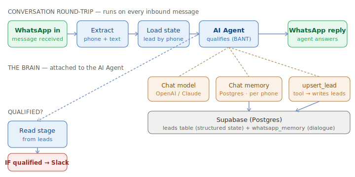
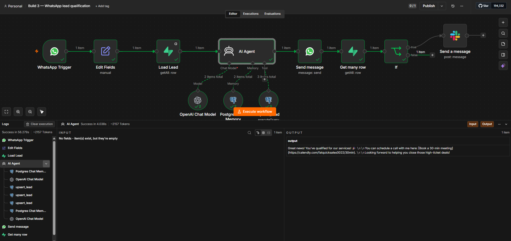
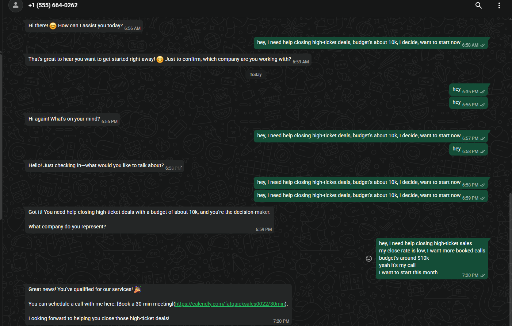

# WhatsApp Lead Qualification Agent (n8n + AI)

An AI agent that **chats with inbound WhatsApp leads, qualifies them over multiple
turns, and writes structured data to a database as it learns** — then routes hot
leads to a booking link and pings sales on Slack.

It runs a real **BANT** qualification (Budget, Authority, Need, Timeline) as a
natural conversation — one question at a time, acknowledging answers — instead of
a rigid form. Because every fact is saved as it's learned and the dialogue is
remembered per phone number, a lead can drop off mid-conversation and **resume days
later** exactly where they left off.

Build 3 of a six-build AI automation portfolio.

> 📖 **[WALKTHROUGH.md](WALKTHROUGH.md)** explains every node in the workflow, line by line.

---

## Why this exists

**The problem —** inbound leads go cold fast. If no one replies within minutes, interest
drops — but replying instantly to *every* lead, 24/7, and asking the right qualifying
questions, is more than a sales team can do by hand. Most leads also aren't a fit, so
reps waste time triaging.

**The result —** an agent that answers WhatsApp leads instantly, any hour, runs a real
BANT qualification as a natural back-and-forth, and saves every fact as it learns it —
so a lead can pick up days later right where they left off. Hot leads get a booking
link and fire a Slack alert to sales; unqualified ones never eat a rep's time.

---

## What it does

- **Listens** for inbound WhatsApp messages (WhatsApp Business Cloud API).
- **Loads** that lead's saved state by phone number, so the agent never re-asks
  what it already knows.
- **Qualifies** conversationally — collects need, company, budget, decision-maker,
  and timeline, keeping a running 0–100 score.
- **Saves as it goes** — calls an `upsert_lead` tool after each new fact, so the
  database always reflects the latest state (even from a half-finished chat).
- **Remembers** the running dialogue in Postgres, keyed by phone — survives restarts.
- **Routes** qualified leads (score ≥ 70, timeline now/this-quarter) to a booking
  link and fires a **Slack alert** to the sales channel.
- **Replies** on WhatsApp with the agent's message every turn.

---

## Architecture



A single workflow, triggered per message. The trick is that **n8n runs statelessly
per message**, so all memory lives outside n8n, keyed by the phone number:

```
WhatsApp Trigger (message in)
   → Edit Fields            (extract phone + text from the WhatsApp payload)
   → Load Lead              (Supabase: get this lead's row by phone)
   → AI Agent               (qualifies; replies)
        ├─ Chat model       (OpenAI / Claude — model-agnostic)
        ├─ Chat memory      (Postgres, session = phone → remembers the dialogue)
        └─ upsert_lead      (Postgres tool — writes BANT fields as they're learned)
   → WhatsApp Send          (deliver the agent's reply to the lead)
   → Get Row (stage)        (read back the stage the agent just set)
   → IF stage = qualified
        └─ Slack            (alert sales: budget, timeline, score, need)
```

### Two kinds of state (the core idea)

| State | Where | Keyed by | Why |
|---|---|---|---|
| **Conversation** | `whatsapp_memory` (Postgres) | phone | the running dialogue, so the agent has context |
| **Structured facts** | `leads` table (Postgres) | phone | BANT fields + score + stage, so a lead can resume |

The agent doesn't just chat — as it learns each fact it **calls tools** to persist
it (`$fromAI(...)` maps the model's output to columns). The score and stage logic
lives in the **prompt**; a downstream `IF` reads the stage from the database to
decide whether to alert sales.

---

## Demo


A live run, split-screen: a prospect messages in on WhatsApp while the n8n canvas
lights up node by node — Trigger → load lead → AI Agent (qualifies + persists BANT)
→ WhatsApp reply → stage check → IF qualified → Slack alert to sales.

---

## Screenshots

**The workflow** — a full run: WhatsApp Trigger → load lead → AI Agent (with `upsert_lead` tool + Postgres chat memory) → reply → check stage → IF qualified → Slack:



**A real conversation** — the agent runs the BANT qualification over WhatsApp and, once the lead qualifies, hands over a booking link:



---

## Tech stack

- **n8n** (cloud or self-hosted) — orchestration
- **OpenAI `gpt-4o-mini`** (or any chat model — the Tools Agent is model-agnostic)
- **WhatsApp Business Cloud API** (Meta) — the messaging channel
- **Supabase** (Postgres) — structured lead state + chat memory, over the Session
  Pooler (IPv4) with a Postgres credential
- **Slack** — qualified-lead alerts

> Build it behind a **Chat Trigger first**, swap WhatsApp in last — the Meta
> developer setup is the fiddly part, and the agent's logic is identical either way.

---

## Setup

1. **Create the database** — run [`sql/schema.sql`](sql/schema.sql) in Supabase's
   SQL Editor. It creates the `leads` table. (`whatsapp_memory` is auto-created by
   the Postgres Chat Memory node on first run.)
2. **Import the workflow** into n8n (`Workflows → ⋯ → Import from File`):
   [`workflows/whatsapp-lead-qualifier.json`](workflows/whatsapp-lead-qualifier.json).
3. **Create credentials** and select them on each node — the JSON ships with
   `REPLACE_WITH_YOUR_*_CREDENTIAL` placeholders:
   - **Chat model** (OpenAI or Anthropic)
   - **Postgres** → point at your Supabase **Session Pooler** (IPv4; the direct
     `db.<ref>.supabase.co` host is IPv6-only and won't reach cloud runners)
   - **WhatsApp** (Trigger + Send) and **Slack**
4. **Fill in the placeholders:** your `[YOUR COMPANY]` and `[YOUR BOOKING LINK]` in
   the system message, the Slack channel (`YOUR_SLACK_CHANNEL_ID`), and the WhatsApp
   `Phone Number ID`.
5. **The `upsert_lead` tool query** lives in
   [`sql/upsert-lead-tool.sql`](sql/upsert-lead-tool.sql) for reference (it's
   embedded in the Postgres tool node).
6. **WhatsApp webhook:** with n8n's WhatsApp OAuth credential, n8n **auto-registers
   the webhook when you Publish** the workflow — don't configure it manually in
   Meta (one trigger per Meta app). Just subscribe the `messages` field and publish.

The system prompt lives in [`prompts/system-prompt.txt`](prompts/system-prompt.txt)
so you can read/tune it without opening the JSON.

---

## Try it

Message the agent like a real lead:

```
hey, I saw your ad about sales training
I run a coaching business, my close rate is low
budget's around $10k
yeah it's my decision
I want to start this month
```

It qualifies turn by turn, a row fills in on the `leads` table, and once it hits
`stage = qualified` you get a Slack alert + a booking link.

---

## Security notes

- **No secrets in this repo.** n8n exports *reference* credentials by name only —
  no API keys. Credential IDs, instance IDs, the WhatsApp Phone Number ID, the
  Slack channel, and the booking link are replaced with placeholders.
- **Tables are backend-only.** RLS is enabled; n8n connects with the Postgres
  user (which bypasses RLS), so nothing is exposed to the public `anon` key.
- **Lead data lives in the database, not the workflow** — the exported JSON
  reveals no real conversations or contacts.

---

## Results & highlights

- **Instant 24/7 first response** — the gap that kills inbound conversion is closed by
  an agent that never sleeps.
- **Resumable conversations** — facts and dialogue are persisted per phone number, so a
  half-finished chat continues days later instead of starting over.
- **Qualifies *and* routes** — runs full BANT, scores 0–100, and only the hot leads
  reach sales (booking link + Slack alert), so reps stop triaging tyre-kickers.
- **Channel-agnostic core** — built behind a Chat Trigger first, WhatsApp swapped in
  last; the same agent drops onto web chat or another channel unchanged.

---

## Roadmap

Build 3 of a six-build n8n AI automation portfolio:

1. MCP personal assistant ✅
2. Competitor intelligence tracker ✅
3. **WhatsApp lead-qualification agent** ✅ (this repo)
4. RAG customer-support chatbot
5. Social-media content bot
6. AI email-triage agent

---

## License

MIT — see `LICENSE` (add your preferred license file).
